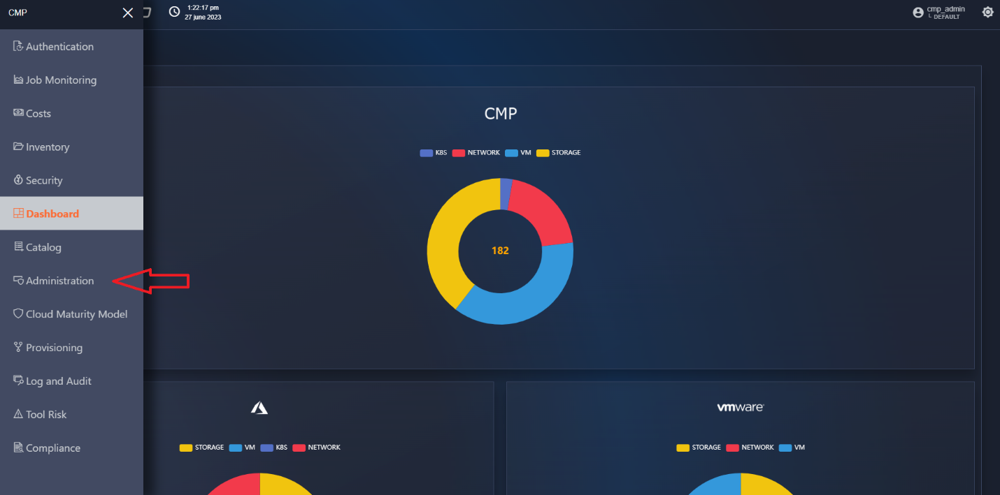

La funzionalità di Administration è la base di partenza per poter
utilizzare la SCMP.

I provider inseriti all’ interno di questa funzionalità verranno
utilizzati dal sistema per recuperare tutte le informazioni necessarie.

All’ interno della funzionalità sarà possibile:

- Configurare i cloud provider che potranno essere utilizzati nel Tenant
  di riferimento;
- Configurare le folder dei vari provider.
- Configurare i cloud SIEM dei vari provider.
- Configurare i KeyVault dei vari provider.

### provider/sottosistemi

#### Lista dei sottosistemi

Per accedere alla funzionalità di Administration, in alto a sinistra
cliccare sul pulsante bento. Dopodiché, cliccare su “Administration”
(Figura 44).

A questo punto, l’utente si ritrova all’interno della pagina del tab
“Cloud Systems” (Figura 45).

<figure>

<figcaption aria-hidden="true">Immagine che contiene schermata, testo,
software, Software multimediale Descrizione generata
automaticamente</figcaption>
</figure>

Figura 44 - Accesso ad Administration

l’utente visualizzerà la dashboard dove viene mostrato l’elenco dei
provider gestiti dalla SCMP.

All’interno della tabella è possibile visualizzare, oltre alla data di
creazione, se il provider è di tipo On-Permise segnalato all’ utente
tramite una spunta di colore rosso sulla riga corrispondente.

Inoltre, per ogni provider è disponibile un “pallino” che indica lo
stato attuale del sottosistema :

- Verde : il sottosistema funziona correttamente nella SCMP “status :
  ok”
- Rosso: il sottosistema non è più utilizzabile dalla SCMP “status :
  failed”

La SCMP effettua periodicamente dei test di connessione su ogni
sottosistema configurato, quando un sottosistema fallisce questo
controllo, esso viene “disabilitato” e non ne verranno più aggiornate le
informazioni (costi, inventario , monitoraggio, sicurezza) .

Questo potrebbe accadere, ad esempio quando il secret o le password
utilizzate per connettersi scadono e devono essere rinnovate.

Andando a modificare il sottosistema (5.6.1.3) è possibile inserire i
nuovi parametri di connessione per ristabilirne il corretto
funzionamento, ed il “pallino” diventerà di colore verde.

#### Creazione nuovo sottosistema

Per inserire un nuovo sottosistema all’ interno del portale bisogna
cliccare sul “menu” disponibile in alto a destra e selezionare “+
Aggiungi nuovo cloud provider”

<figure>

<figcaption aria-hidden="true">Immagine che contiene testo, schermata,
software, Software multimediale Descrizione generata
automaticamente</figcaption>
</figure>

Figura 45 - Aggiunta di un nuovo Cloud Provider

L’utente visualizza i dati di base del sottosistema da inserire,
spiegati in seguito

##### **Parametri condivisi**

All’ interno della pagina di creazione (Figura 46) possiamo notare 3
campi :

- Nome : indica il nome che verrà visualizzato per indicare il
  sottosistema
- Tipo: indica la tipologia di cloud provider al quale appartiene il
  sottosistema
- Versione: la versione relativa al provider del sottosistema da
  installare

<figure>

<figcaption aria-hidden="true">Immagine che contiene testo, schermata,
software, Software multimediale Descrizione generata
automaticamente</figcaption>
</figure>

Figura 46 - Parametri generali di un sottosistema

Dopo aver selezionato la tipologia e la versione del sistema la maschera
si aggiorna per visualizzare i parametri specifici in base al provider
selezionato, visto che ognuno di loro gestisce l’autenticazione e le
risorse in maniera differente.

Tutti i provider richiedono un’autenticazione, che può variare in base
al sistema, per il recupero degli asset.

Queste informazioni sensibili, come password o certificati, vengono
salvati in maniera sicura su un elemento infrastrutturale che si occupa
della sicurezza dei dati (<https://www.vaultproject.io/>).

##### **Parametri Azure**

Funzionalità abilitate:

1.  Recupero elementi di catalogo
2.  Recupero elementi di inventario
3.  Recupero delle metriche di utilizzo
4.  Recupero dei costi delle risorse
5.  Recupero delle informazioni di sicurezza
6.  Provisioning di risorse
7.  Provisioning di servizi
8.  Provisioning di blueprint complesse

I parametri specifici (Figura 47) del sottosistema Azure da inserire
sono esposti nella tabella

<figure>

<figcaption aria-hidden="true">Immagine che contiene testo, schermata,
software, Software multimediale Descrizione generata
automaticamente</figcaption>
</figure>

Figura 47 - Maschera di configurazione Azure

Vengono indicati con \* i parametri obbligatori

| **Nome**             | **Tipo** | **Descrizione**                                                                                                                                                                           | **esempio**                               |
|----------------------|----------|-------------------------------------------------------------------------------------------------------------------------------------------------------------------------------------------|-------------------------------------------|
| clientId **\***      | string   | L’ID univoco del client che si connette al sottosistema Azure Cloud. Questo ID viene utilizzato per identificare il client e per autorizzare l’accesso alle risorse del sottosistema.     | 5a85c16c6ad-49db-a58e-e209-ee11f53d6c6b   |
| clientSecret \*      | password | La chiave segreta del client, utilizzata per autenticare il client con il sottosistema Azure Cloud. La chiave segreta deve essere tenuta segreta e non deve essere condivisa con nessuno. | np6Kc\_.xwsvhR8Q~rP05fCqYNXmbqfMGQLOEzfMt |
| tenantId \*          | string   | L’ID del tenant Azure a cui appartiene il sottosistema Azure Cloud. Il tenant è un’entità organizzativa in Azure che rappresenta un’azienda o un’organizzazione.                          | 884147733-ff13-4783-a765-834183773083     |
| subscriptionId \*    | string   | L’ID della sottoscrizione Azure utilizzata per accedere al sottosistema Azure Cloud. La sottoscrizione è un contratto per l’utilizzo dei servizi Azure.                                   | 884147733-ff13-4783-a765-834183773083     |
| usageAggregation     | boolean  | Indica se l’aggregazione per “usage” è abilitata per la sottoscrizione. Quando questa spunta viene abilitata i costi del sottosistema verranno raggruppati per Tipologia risorsa          | false                                     |
| catalogPriceDiscount | integer  | Inserisci qui uno sconto/maggiorazione da applicare sui prezzi del catalogo per tutte le risorse che non hanno una relazione CMP                                                          | 5                                         |
| odlID                | string   | Inserisci qui l’id dell’ordine di lavoro che verrà associato al sottosistema e verrà inserito come tag su tutte le risorse del sottosistema                                               | ODL001                                    |
| clientId             | string   | L’ID univoco del client che si connette al sottosistema Azure Cloud. Questo ID viene utilizzato per identificare il client e per autorizzare l’accesso alle risorse del sottosistema.     | 5a85c16c6ad-49db-a58e-e209-ee11f53d6c6b   |
| datsFirstCostRecover | int      | Inserire il numero di giorni precedenti alla data di creazione dei quali bisogna recuperare i costi al primo avvio del sottosistema                                                       | 15                                        |

Tabella 9 – Campi specifici Azure

##### **Parametri AzureStack**

Funzionalità abilitate:

1.  Recupero elementi di catalogo
2.  Recupero elementi di inventario
3.  Recupero delle metriche di utilizzo
4.  Recupero dei costi delle risorse
5.  Recupero delle informazioni di sicurezza
6.  Provisioning di risorse
7.  Provisioning di servizi
8.  Provisioning di blueprint complesse

I parametri specifici del sottosistema AzureStack da inserire sono
esposti nella tabella

Figura 48 - Maschera di configurazione AzureStack

Vengono indicati con \* i parametri obbligatori

| **Nome**              | **Tipo**         | **Descrizione**                                                                                                                                                                       | **esempio**                                                                     |
|-----------------------|------------------|---------------------------------------------------------------------------------------------------------------------------------------------------------------------------------------|---------------------------------------------------------------------------------|
| clientId \*           | string           | L’ID univoco del client che si connette al sottosistema Azure Stack. Questo ID viene utilizzato per identificare il client e per autorizzare l’accesso alle risorse del sottosistema. | 3552d471-58e3-4099-aabe-e4973e312be7                                            |
| clientSecret \*       | password         | La chiave segreta del client, utilizzata per autenticare il client con il sottosistema Azure Stack                                                                                    | np6Kc\_.xwsvhR8Q~rP05fCqYNXmbqfMGQLOEzfMt                                       |
| tenantId \*           | string           | L’ID del tenant Azure a cui appartiene il sottosistema Azure Stack. Il tenant è un’entità organizzativa in Azure che rappresenta un’azienda o un’organizzazione.                      | npYN\_.xwsvhRqXmbqf6KhRqMGQLO8Q~rP05fCEzfMt                                     |
| url \*                | string           | L’URL dell’endpoint di Resource Manager per Azure Stack. Questo endpoint viene utilizzato per gestire le risorse Azure Stack                                                          | <https://management.infroma.microsoft.com/3552d471-58e3-4099-aabe-e4973e312be7> |
| armEndpoint \*        | string           | L’URL dell’endpoint di Resource Manager per Azure Stack. Questo endpoint viene utilizzato per gestire le risorse Azure Stack                                                          | <https://management.gfis.cloud.azurs.priv/>                                     |
| subscriptionId \*     | string           | L’ID della sottoscrizione Azure utilizzata per accedere al sottosistema Azure Stack. La sottoscrizione è un contratto per l’utilizzo dei servizi Azure                                | 3552d471-58e3-4099-aabe-e4973e312be7                                            |
| costClientId \*       | string           | L’ID client per l’accesso ai dati di costo.                                                                                                                                           | 3e312be7-58e3-4099-aabe-e4973552d471                                            |
| costClientSecret \*   | password         | La chiave segreta del client per l’accesso ai dati di costo                                                                                                                           | np6Kc\_.xwsvhR8Q~rP05fCqYNXmbqfMGQLOEzfMt                                       |
| costTenantId \*       | string           | L’ID del tenant per l’accesso ai dati di costo.                                                                                                                                       | 3e312be7-58e3-4099-aabe-e4973552d471                                            |
| costSubscriptionId \* | string           | L’ID della sottoscrizione per l’accesso ai dati di costo.                                                                                                                             | 3552d471-58e3-4099-aabe-e4973e312be7                                            |
| location \*           | string           | Inserire la regione nella quale è disponibile il sottosistema                                                                                                                         | euw-Rome-1                                                                      |
| totalCPU \*           | Positive Integer | il numero delle CPU totali disponibili nel sottosistema                                                                                                                               | 64                                                                              |
| totalRAM \*           | Positive Integer | Il valore in MB della RAM totale disponibile nel sottosistema                                                                                                                         | 25500                                                                           |
| totalStorage \*       | Positive Integer | Il vlaore in GB dello spazio totale disponibile sul sottosistema                                                                                                                      | 5000                                                                            |
| catalogPriceDiscount  | integer          | Inserisci qui uno sconto/maggiorazione da applicare sui prezzi del catalogo per tutte le risorse che non hanno una relazione CMP                                                      | -10                                                                             |
| odlID                 | string           | Inserisci qui l’id dell’ordine di lavoro che verrà associato al sottosistema e verrà inserito come tag su tutte le risorse del sottosistema                                           | ODL001                                                                          |

Tabella 10 – Campi specifici AzureStack

Per i provider on Premise, in particolare, vengono richiesti dati sulla
capacità della infrastruttura, in modo tale che la SCMP possa effettuare
dei calcoli preliminari in molteplici scenari.

Per esempio, durante il provisioning, in modo tale da non superare la
capacità massima consentita del provider.

##### **Parametri AzureStack HCI**

Funzionalità abilitate:

1.  Recupero elementi di catalogo
2.  Recupero elementi di inventario
3.  Recupero delle metriche di utilizzo
4.  Recupero dei costi delle risorse
5.  Recupero delle informazioni di sicurezza
6.  Provisioning di risorse
7.  Provisioning di servizi
8.  Provisioning di blueprint complesse

I parametri specifici del sottosistema AzureStack HCI da inserire sono
esposti nella tabella

Figura 49 - Maschera di configurazione AzureStack HCI

Vengono indicati con \* i parametri obbligatori

| **Nome**             | **Tipo**         | **Descrizione**                                                                                                                                                                       | **esempio**                          |
|----------------------|------------------|---------------------------------------------------------------------------------------------------------------------------------------------------------------------------------------|--------------------------------------|
| Username \*          | string           | Username di accesso per utilizzare la macchina Bridge                                                                                                                                 | AdminUser                            |
| Password \*          | password         | Password di accesso per utilizzare la macchina Bridge                                                                                                                                 | Pasword1                             |
| bridgeIp \*          | string           | Ip identificativo della macchine Bridge                                                                                                                                               | 192.168.1.1                          |
| clientId \*          | string           | L’ID univoco del client che si connette al sottosistema Azure Stack. Questo ID viene utilizzato per identificare il client e per autorizzare l’accesso alle risorse del sottosistema. | 3552d471-58e3-4099-aabe-e4973e312be7 |
| clientSecret \*      | password         | La chiave segreta del client, utilizzata per autenticare il client con il sottosistema Azure Stack                                                                                    |                                      |
| tenantId \*          | string           | L’ID del tenant Azure a cui appartiene il sottosistema Azure Stack. Il tenant è un’entità organizzativa in Azure che rappresenta un’azienda o un’organizzazione.                      | 3552d471-58e3-4099-aabe-e4973e312be7 |
| subscriptionId \*    | string           | L’ID della sottoscrizione Azure utilizzata per accedere al sottosistema Azure Stack. La sottoscrizione è un contratto per l’utilizzo dei servizi Azure                                | 3552d471-58e3-4099-aabe-e4973e312be8 |
| location \*          | string           | Inserire la regione nella quale è disponibile il sottosistema                                                                                                                         | euw-Milan-002                        |
| totalCPU \*          | Positive Integer | il numero delle CPU totali disponibili nel sottosistema                                                                                                                               | 64                                   |
| totalRAM \*          | Positive Integer | Il valore in MB della RAM totale disponibile nel sottosistema                                                                                                                         | 52000                                |
| totalStorage \*      | Positive Integer | Il valore in GB dello spazio totale disponibile sul sottosistema                                                                                                                      | 5000                                 |
| catalogPriceDiscount | integer          | Inserisci qui uno sconto/maggiorazione da applicare sui prezzi del catalogo per tutte le risorse che non hanno una relazione CMP                                                      | 10                                   |
| odlID                | string           | Inserisci qui l’id dell’ordine di lavoro che verrà associato al sottosistema e verrà inserito come tag su tutte le risorse del sottosistema                                           | ODL0001                              |

Tabella 11 – Campi specifici AzureStack HCI

Per i provider on Premise, in particolare, vengono richiesti dati sulla
capacità della infrastruttura, in modo tale che la SCMP possa effettuare
dei calcoli preliminari in molteplici scenari.

Per esempio, durante il provisioning, in modo tale da non superare la
capacità massima consentita del provider.

##### **Parametri AzureStack Hybrid cloud**

Funzionalità abilitate:

1.  Recupero elementi di catalogo
2.  Recupero elementi di inventario
3.  Recupero delle metriche di utilizzo
4.  Provisioning di risorse
5.  Provisioning di servizi
6.  Provisioning di blueprint complesse

I parametri specifici del sottosistema AzureStack Hybrid cloud da
inserire sono esposti nella tabella

Figura 50 - Maschera di configurazione AzureStack Hybrid cloud

Vengono indicati con \* i parametri obbligatori

| **Nome**             | **Tipo**         | **Descrizione**                                                                                                                             | **esempio**       |
|----------------------|------------------|---------------------------------------------------------------------------------------------------------------------------------------------|-------------------|
| username \*          | string           | Username di accesso per utilizzare la macchina Bridge                                                                                       | AdminUser         |
| password \*          | password         | Password di accesso per utilizzare la macchina Bridge                                                                                       | PasswordAdmin1    |
| bridgeIp             | string           | Ip identificativo della macchine Bridge                                                                                                     | 192.168.1.1       |
| needBridge           | boolean          | Se abilitato indica che la macchina di bridge non è all’interno del cluster                                                                 | true              |
| clusterName          | string           | Nome del cluster per stabilire una sessione powershell, se il campo ” needBridge = True”                                                    | my.cluster.online |
| ncUri                | string           | Inserisci qui l’URI del controllore di rete                                                                                                 |                   |
| totalCPU \*          | Positive Integer | il numero delle CPU totali disponibili nel sottosistema                                                                                     | 36                |
| totalRAM \*          | Positive Integer | Il valore in MB della RAM totale disponibile nel sottosistema                                                                               | 25000             |
| totalStorage \*      | Positive Integer | Il vlaore in GB dello spazio totale disponibile sul sottosistema                                                                            | 500               |
| catalogPriceDiscount | integer          | Inserisci qui uno sconto/maggiorazione da applicare sui prezzi del catalogo per tutte le risorse che non hanno una relazione CMP            | 10                |
| odlID                | string           | Inserisci qui l’id dell’ordine di lavoro che verrà associato al sottosistema e verrà inserito come tag su tutte le risorse del sottosistema | ODL001            |

Tabella 12 – Campi specifici AzureStack Hybrid Cloud

Per i provider on Premise, in particolare, vengono richiesti dati sulla
capacità della infrastruttura, in modo tale che la SCMP possa effettuare
dei calcoli preliminari in molteplici scenari.

Per esempio, durante il provisioning, in modo tale da non superare la
capacità massima consentita del provider.

##### **Parametri Amazon Web Services**

Funzionalità abilitate:

1.  Recupero elementi di catalogo
2.  Recupero elementi di inventario
3.  Recupero delle metriche di utilizzo
4.  Recupero dei costi delle risorse
5.  Recupero delle informazioni di sicurezza
6.  Provisioning di risorse
7.  Provisioning di servizi
8.  Provisioning di blueprint complesse

I parametri specifici del sottosistema Amazon Web Services da inserire
sono esposti nella tabella

Figura 51 - Maschera di configurazione Amazon Web Services

Vengono indicati con \* i parametri obbligatori

| **Nome**             | **Tipo** | **Descrizione**                                                                                                                             | **esempio**                               |
|----------------------|----------|---------------------------------------------------------------------------------------------------------------------------------------------|-------------------------------------------|
| clientId \*          | string   | La chiave di accesso AWS è una stringa alfanumerica che identifica l’utente AWS.                                                            | ZYKZGVAKIS4YK5IXCAXB                      |
| clientSecret \*      | password | La chiave di accesso segreta AWS è una stringa alfanumerica che viene utilizzata per autenticare l’utente AWS                               | np6Kc\_.xwsvhR8Q~rP05fCqYNXmbqfMGQLOEzfMt |
| catalogPriceDiscount | integer  | Inserisci qui uno sconto/maggiorazione da applicare sui prezzi del catalogo per tutte le risorse che non hanno una relazione CMP            | 5                                         |
| odlID                | string   | Inserisci qui l’id dell’ordine di lavoro che verrà associato al sottosistema e verrà inserito come tag su tutte le risorse del sottosistema | ODL001                                    |

Tabella 13 – Campi specifici Amazon Web Services

##### **Parametri Google Cloud**

Funzionalità abilitate:

1.  Recupero elementi di catalogo
2.  Recupero elementi di inventario
3.  Recupero delle metriche di utilizzo
4.  Recupero dei costi delle risorse
5.  Recupero delle informazioni di sicurezza
6.  Provisioning di risorse
7.  Provisioning di servizi
8.  Provisioning di blueprint complesse

I parametri specifici del sottosistema Google Cloud da inserire sono
esposti nella tabella, il campo “Service account” può essere inserito
sia automaticamente che manualmente come descritto nel paragrafo.

Figura 52 - Maschera di configurazione Google

Vengono indicati con \* i parametri obbligatori

| **Nome**              | **Tipo** | **Descrizione**                                                                                                                                                                  | **esempio**                                                                     |
|-----------------------|----------|----------------------------------------------------------------------------------------------------------------------------------------------------------------------------------|---------------------------------------------------------------------------------|
| serviceAccount \*     | object   | File di connessione generato dalla console Google                                                                                                                                | service_account.json                                                            |
| discoveryProjectId \* | string   | Identificativo del progetto di cui si effettuerà il discovery                                                                                                                    | Theproject-547280                                                               |
| costExportProjectId   | string   | Dataset id del service account di esportazione costi se il dataset è differente dal ProjectID                                                                                    | test-customer.test_customer.gcp_billing_export_resource_v1_01527DF_51B683_EB2A9 |
| usageAggregation      | boolean  | Indica se l’aggregazione per “usage” è abilitata per la sottoscrizione. Quando questa spunta viene abilitata i costi del sottosistema verranno raggruppati per Tipologia risorsa | false                                                                           |
| catalogPriceDiscount  | integer  | Inserisci qui uno sconto/maggiorazione da applicare sui prezzi del catalogo per tutte le risorse che non hanno una relazione CMP                                                 | -5                                                                              |
| odlID                 | string   | Inserisci qui l’id dell’ordine di lavoro che verrà associato al sottosistema e verrà inserito come tag su tutte le risorse del sottosistema                                      | ODL001                                                                          |
| datsFirstCostRecover  | int      | Inserire il numero di giorni precedenti alla data di creazione dei quali bisogna recuperare i costi al primo avvio del sottosistema                                              | 15                                                                              |

Tabella 14 – Campi specifici Google

Figura 53 - Caricamento del file di configurazione

Effettuando l’upload del file il form viene completato automaticamente
con i parametri necessari, ma è possibile anche inserirli manualmente
(riquadro giallo presente nell’ immagine, Figura 53) seguendo la
tabella, tutti i campi sono obbligatori:

| **Nome**                      | **Tipo** | **Descrizione**                                                                                                                                 | **esempio**                                                                                            |
|-------------------------------|----------|-------------------------------------------------------------------------------------------------------------------------------------------------|--------------------------------------------------------------------------------------------------------|
| type                          | string   | Inserire il nome della tipologia di autenticazione configurata                                                                                  | service_account                                                                                        |
| project_id \*                 | string   | Inserisci qui l’id univoco del progetto associato al service account                                                                            | Theproject-367810                                                                                      |
| private_key_id \*             | string   | Inserisci qui l’id univoco della chiave privata del service account                                                                             | 55cb5cf903ee93ea1e9c294a07e46e0af0633e6                                                                |
| private_key \*                | password | Contiene la chiave privata del service account in formato PEM. È fondamentale per l’autenticazione del service account alle API di Google Cloud | —–BEGIN PRIVATE KEY—–MIIJQgIBADANB…                                                                    |
| client_e-mail \*              | string   | L’indirizzo e-mail univoco del service account. È utilizzato per identificare il service account quando si autentica alle API di Google Cloud   | <user@dominio.com>                                                                                     |
| client_id \*                  | string   | L’ID client del service account. È un identificatore univoco utilizzato per identificare il service account in Google Cloud                     | 104822473261100667392                                                                                  |
| auth_uri \*                   | string   | L’URI utilizzato per l’autenticazione del service account alle API di Google Cloud                                                              | https://accounts.google.com/o/oauth2/auth                                                              |
| token_uri \*                  | string   | L’URI utilizzato per ottenere un token di accesso per il service account                                                                        | https://oauth2.googleapis.com/token                                                                    |
| auth_provider_x509_cert_url\* | string   | L’URL del certificato X.509 utilizzato per l’autenticazione del service account                                                                 | https://www.googleapis.com/oauth2/v1/certs                                                             |
| client_x509_cert_url \*       | string   | L’URL del certificato X.509 nel client                                                                                                          | <https://www.googleapis.com/robot/v1/metadata/f543/myserviceaccount%40projectName.gserviceaccount.com> |

Tabella 15 – Campi specifici obbligatori del file “service_account.json”

##### **Parametri Openshift**

Funzionalità abilitate:

1.  Recupero elementi di catalogo
2.  Recupero elementi di inventario
3.  Recupero delle metriche di utilizzo
4.  Recupero dei costi delle risorse
5.  Recupero delle informazioni di sicurezza
6.  Provisioning di risorse
7.  Provisioning di servizi
8.  Provisioning di blueprint complesse

I parametri specifici del sottosistema Openshift da inserire sono
esposti nella tabella

Figura 54 - Maschera di configurazione Openshift

Vengono indicati con \* i parametri obbligatori

| **Nome**    | **Tipo**         | **Descrizione**                                                                                                                             | **esempio**                                                   |
|-------------|------------------|---------------------------------------------------------------------------------------------------------------------------------------------|---------------------------------------------------------------|
| username \* | string           | Inserisci qui il nome utente del profilo configurato                                                                                        | Admin                                                         |
| password \* | password         | Inserisci qui la password del profilo configurato                                                                                           | AdminPassword123                                              |
| Port \*     | Positive Integer | Inserisci qui la porta dell’API server                                                                                                      | 6443                                                          |
| url \*      | string           | Inserisci qui l’API url di connessione al profilo                                                                                           | [https://api.cloud.my.url.com](https://api.cloud.my.url.com/) |
| odlID       | string           | Inserisci qui l’id dell’ordine di lavoro che verrà associato al sottosistema e verrà inserito come tag su tutte le risorse del sottosistema | ODL001                                                        |

Tabella 16 – Campi specifici OpenShift

##### **Parametri Oracle**

Funzionalità abilitate:

1.  Recupero elementi di catalogo
2.  Recupero elementi di inventario
3.  Recupero dei costi delle risorse
4.  Recupero delle informazioni di sicurezza

I parametri specifici del sottosistema Oracle da inserire sono esposti
nella tabella

Figura 55 - Maschera di configurazione Oracle

Vengono indicati con \* i parametri obbligatori

| **Nome**             | **Tipo** | **Descrizione**                                                                                                                             | **esempio**                                                                     |
|----------------------|----------|---------------------------------------------------------------------------------------------------------------------------------------------|---------------------------------------------------------------------------------|
| username \*          | string   | Il nome utente utilizzato per l’autenticazione con OCI.                                                                                     | ocid5.user.oc77.aaabnbthaj6pnvsb2gqnaaaaait3mqzekefmlhwkige2wxna6hfaj3f6njma    |
| fingerprint \*       | string   | è un valore univoco che identifica il dispositivo, utilizzato per l’autenticazione con OCI.                                                 | 6a:f4:6e:9a:73:95:27:d5:64:8d11:a3:f5:0e:fb:f4:                                 |
| tenantId \*          | string   | L’ID del tenant OCI a cui ci si vuole connettere                                                                                            | ocid5.tenancy.oc77…aaabnbthaj6pnvsb2gqnaaaaait3mqzekefmlhwkige2wxna6hfaj3f6njma |
| region \*            | string   | La regione è ls posizione geografica specifica in cui si trovano le risorse OCI.                                                            | eu-dcc-rome-1                                                                   |
| realm                | string   | Il nome del contenitore logico che raggruppa le risorse OCI e i relativi costi.                                                             | personal-realm.it                                                               |
| keyFile \*           | password | un file PEM che contiene la chiave pubblica e privata utilizzata per l’autenticazione.                                                      | ” —–BEGIN PRIVATE KEY—–MIIJQgIBADANB…”                                          |
| catalogPriceDiscount | integer  | Inserisci qui uno sconto/maggiorazione da applicare sui prezzi del catalogo per tutte le risorse che non hanno una relazione CMP            | -10                                                                             |
| odlID                | string   | Inserisci qui l’id dell’ordine di lavoro che verrà associato al sottosistema e verrà inserito come tag su tutte le risorse del sottosistema | ODL001                                                                          |

Tabella 17 – Campi specifici Oracle

##### **Parametri VCloud**

Funzionalità abilitate:

1.  Recupero elementi di catalogo
2.  Recupero elementi di inventario
3.  Recupero delle metriche di utilizzo
4.  Recupero dei costi delle risorse
5.  Recupero delle informazioni di sicurezza

I parametri specifici del sottosistema VCloudDirector da inserire sono
esposti nella tabella

Figura 56 - Maschera di configurazione VCloudDirector

Vengono indicati con \* i parametri obbligatori

| **Nome**             | **Tipo** | **Descrizione**                                                                                                                             | **esempio**                                        |
|----------------------|----------|---------------------------------------------------------------------------------------------------------------------------------------------|----------------------------------------------------|
| url \*               | string   | l’indirizzo del server VCloudDirector a cui ci si vuole connettere                                                                          | <https://url.westeurope.com/tenant/org-zzg-435832> |
| tenantId \*          | string   | L’ID del tenant del VCloudDirector è l’identificatore univoco del tenant a cui ci si vuole connettere.                                      | org-zzg-435832                                     |
| token \*             | password | Il token di autenticazione per il VCloudDirector è una stringa segreta che viene utilizzata per autenticare l’utente con il VCloudDirector  | aesZo6LextKTQx92VoRpyzaesZo6LextKT                 |
| catalogPriceDiscount | integer  | Inserisci qui uno sconto/maggiorazione da applicare sui prezzi del catalogo per tutte le risorse che non hanno una relazione CMP            | 5                                                  |
| odlID                | string   | Inserisci qui l’id dell’ordine di lavoro che verrà associato al sottosistema e verrà inserito come tag su tutte le risorse del sottosistema | ODL001                                             |

Tabella 18 – Campi specifici VCloud Director

##### **Parametri VMWare**

Funzionalità abilitate:

1.  Recupero elementi di catalogo
2.  Recupero elementi di inventario
3.  Recupero delle metriche di utilizzo
4.  Recupero dei costi delle risorse
5.  Recupero delle informazioni di sicurezza
6.  Provisioning di risorse
7.  Provisioning di servizi
8.  Provisioning di blueprint complesse

I parametri specifici del sottosistema VMWare da inserire sono esposti
nella tabella

Figura 57 - Maschera di configurazione VMWare

Vengono indicati con \* i parametri obbligatori

| **Nome**             | **Tipo**         | **Descrizione**                                                                                                                             | **esempio**                                                   |
|----------------------|------------------|---------------------------------------------------------------------------------------------------------------------------------------------|---------------------------------------------------------------|
| username \*          | string           | Inserisci qui il nome utente del profilo configurato                                                                                        | Admin                                                         |
| password \*          | password         | Inserisci qui la password del profilo configurato                                                                                           | AdminPassword123                                              |
| url \*               | string           | Inserisci qui l’API url di connessione al profilo                                                                                           | [https://api.cloud.my.url.com](https://api.cloud.my.url.com/) |
| Location             | String           | Inserisci qui la regione di appartenenza                                                                                                    | Euw_rome_001                                                  |
| totalCPU \*          | Positive Integer | il numero delle CPU totali disponibili nel sottosistema                                                                                     | 64                                                            |
| totalRAM \*          | Positive Integer | Il valore in MB della RAM totale disponibile nel sottosistema                                                                               | 52000                                                         |
| totalStorage \*      | Positive Integer | Il valore in GB dello spazio totale disponibile sul sottosistema                                                                            | 5000                                                          |
| catalogPriceDiscount | integer          | Inserisci qui uno sconto/maggiorazione da applicare sui prezzi del catalogo per tutte le risorse che non hanno una relazione CMP            | 10                                                            |
| odlID                | string           | Inserisci qui l’id dell’ordine di lavoro che verrà associato al sottosistema e verrà inserito come tag su tutte le risorse del sottosistema | ODL0001                                                       |

Tabella 19 – Campi specifici Azure

Per i provider on Premise, in particolare, vengono richiesti dati sulla
capacità della infrastruttura, in modo tale che la SCMP possa effettuare
dei calcoli preliminari in molteplici scenari.

Per esempio, durante il provisioning, in modo tale da non superare la
capacità massima consentita del provider.

#### Verifica della connessione e salvataggio

Per tutti i sottosistemi sono disponibili in basso nella pagina 3
pulsanti (Figura 58) :

Il tasto “Chiudi” che permette di annullare l’inserimento di un nuovo
sottosistema

Il tasto “Test Connection” serve ad effettuare un test di connessione
utilizzando i parametri inseriti, in caso di errori il sistema ritorna
un messaggio di errore che indica “Error: Unauthorized system” e il
pulsante diventa di colore rosso, in caso contrario il pulsante
diventerà verde e sarà possibile salvare il sottosistema utilizzando il
tasto “Salva”

<figure>

<figcaption aria-hidden="true">Immagine che contiene testo, schermata,
Software multimediale, software Descrizione generata
automaticamente</figcaption>
</figure>

Figura 58 - Pulsanti di connessione

Al salvataggio, la SCMP comunicherà al modulo che gestisce quella
tipologia di provider, di caricare all’interno del nostro bus (Kafka)
tutti gli item relativi all’inventario, metriche, costi ed elementi di
security.

Lo stesso modulo, si occuperà successivamente di schedulare dei job per
l’aggiornamento periodico di tutti gli asset presenti.

Dopo aver salvato, apparirà una modale che informa l’utente che non è
possibile eliminare un cloud provider prima delle 24 ore. Dalla modale,
cliccare su “OK”. Dopo aver fatto ciò, l’utente si ritrova all’interno
della pagina dei Cloud Provider.

#### Visualizzazione edit ed eliminazione di un sottosistema

È possibile visualizzare i dati di un Cloud Provider, all’interno della
lista, cliccare sul kebab menu in corrispondenza di un Cloud Provider, e
cliccare su “Show” (Figura 59).

<figure>

<figcaption aria-hidden="true">Immagine che contiene testo, screenshot,
monitor, nero Descrizione generata automaticamente</figcaption>
</figure>

Figura 59- Accesso al Cloud Provider in modalità visualizzazione

In questa pagina è possibile visualizzare la configurazione del Provider
(Figura 60).

<figure>

<figcaption aria-hidden="true">A screenshot of a computer Description
automatically generated with medium confidence</figcaption>
</figure>

Figura 60 - Visualizzazione cloud in modalità visualizzazione

Se il provider è di tipo “ON-PREMISE” sotto la configurazione sarà
visibile una tabella che riporta le capacità utilizzabili sul sistema e
la lista delle macchine già presenti sul provider (Figura 61).

<figure>

<figcaption aria-hidden="true">A screenshot of a computer Description
automatically generated with medium confidence</figcaption>
</figure>

Figura 61 - Lista macchine On-Premise

Per tornare alla pagina dei Cloud Provider, in basso a sinistra,
cliccare sul pulsante “Close”.

A questo punto, l’utente si ritroverà all’interno della pagina dei Cloud
Provider.

Per modificare i dati di un Cloud Provider, all’interno della lista,
cliccare sul kebab menu in corrispondenza di un Cloud Provider, e
cliccare su “Edit” (Figura 62).

<figure>

<figcaption aria-hidden="true">Immagine che contiene testo, screenshot,
monitor, nero Descrizione generata automaticamente</figcaption>
</figure>

Figura 62 - Accesso al Cloud Provider in modalità edit

Fatto ciò, l’utente si ritroverà all’interno della pagina del Cloud
Provider in modalità edit in cui è possibile modificare i dati. Per
tornare alla pagina dei Cloud Provider, in basso a sinistra, cliccare
sul pulsante “Save”. A questo punto, l’utente si ritroverà all’interno
della pagina dei Cloud Provider.

<figure>

<figcaption aria-hidden="true">Immagine che contiene testo, screenshot,
monitor, nero Descrizione generata automaticamente</figcaption>
</figure>

Figura 63 - Avvio per l’eliminazione di un Cloud Provider

Per eliminare un Cloud Provider, all’interno della lista, cliccare sul
kebab menu in corrispondenza di un Cloud Provider, e cliccare su
“Delete” (Figura 63).

<figure>

<figcaption aria-hidden="true">Immagine che contiene testo, monitor,
screenshot, interni Descrizione generata automaticamente</figcaption>
</figure>

Figura 64 - Conferma eliminazione del Cloud Provider

Fatto ciò, apparirà una modale in cui è necessario cliccare sul pulsante
“Remove” (Figura 64).

A questo punto, il Cloud Provider non sarà più presente all’interno
della lista e verrà lanciato il flusso di rimozione asset sul
resource-manager.

#### Google Cloud Folders

Per consentire alla SCMP di sfruttare tutte le potenzialità offerte dal
provider “Google Cloud” è stata inserita la possibilità di configurare
delle “Folders” e la possibilità di importare il file generato dalla
console del provider così da semplificare l’inserimento dello stesso.

Durante la creazione di un provider selezionando la tipologia “Google
Cloud” (5.6.1.2.7) possiamo notare la presenza di 2 campi esclusivi per
il provider (Figura 65):

1.  Un box di conferma per indicare alla SCMP se il provider in
    inserimento è una “Folder”
2.  Un box dove, cliccando all’ interno sarà possibile, tramite la
    finestra di selezione file di windows inserire il file di tipo
    “JSON” esportato direttamente dalla console Google

<figure>

<figcaption aria-hidden="true">Immagine che contiene testo, schermata,
software, Software multimediale Descrizione generata
automaticamente</figcaption>
</figure>

Figura 65 – Parametri specifici di Google Cloud

I parametri specifici della Google Folder da inserire sono esposti nella
tabella:

| **Nome**             | **Tipo** | **Descrizione**                                                                                                                                                                  | **esempio**          |
|----------------------|----------|----------------------------------------------------------------------------------------------------------------------------------------------------------------------------------|----------------------|
| serviceAccount       | object   | File di connessione generato dalla console Google                                                                                                                                | service_account.json |
| usageAggregation     | boolean  | Indica se l’aggregazione per “usage” è abilitata per la sottoscrizione. Quando questa spunta viene abilitata i costi del sottosistema verranno raggruppati per Tipologia risorsa | false                |
| catalogPriceDiscount | integer  | Inserisci qui uno sconto/maggiorazione da applicare sui prezzi del catalogo per tutte le risorse che non hanno una relazione CMP                                                 | -20                  |
| odlID                | string   | Inserisci qui l’id dell’ordine di lavoro che verrà associato al sottosistema e verrà inserito come tag su tutte le risorse del sottosistema                                      | ODL001               |
| datsFirstCostRecover | int      | Inserire il numero di giorni precedenti alla data di creazione dei quali bisogna recuperare i costi al primo avvio del sottosistema                                              | 15                   |

Tabella 20 – Campi specifici Google Folder

Il campo “ServiceAccount” è formato dai campi indicati nel paragrafo
5.6.1.2.7 e può essere inserito automaticamente effettuando l’upload del
file o manualmente inserendo i campi disponibili nel form.

Dopo aver configurato un sistema di tipo “Folder” esso non verrà
visualizzato nella lista dei cloud provider, per trovarlo dalla pagina
di “Cloud System” del modulo di “Administration” cliccare in alto a
destra il tab “Folders” (Figura 66) dove verrà visualizzata la lista
delle folder configurate nel tenant.

All’ interno della pagina è possibile effettuare le stesse operazioni di
visualizzazione modifica e eliminazione delle folder effettuate sulla
pagina dei “Cloud Provider” (5.6.1.4)

<figure>

<figcaption aria-hidden="true">Immagine che contiene schermata, testo,
software, Software multimediale Descrizione generata
automaticamente</figcaption>
</figure>

Figura 66 – Accesso a Folders

Accedendo ad una “Folder” in modalità “View” scorrendo in basso nella
pagina possiamo visualizzare la lista dei sottosistemi presenti nel
provider e le relative informazioni sullo status :

- In verde possiamo notare un sottosistema configurato correttamente nel
  provider e che la SCMP provvede ad inserire automaticamente nel
  sistema e sarà visibile nella sezione “Cloud Providers” e in tutte le
  funzionalità della SCMP.
- In rosso possiamo notare un sottosistema configurato in maniera errata
  che, dopo le opportune modifiche dalla console di “Google Cloud”,
  potrà essere accettato dalla SCMP.

<figure>

<figcaption aria-hidden="true">Immagine che contiene testo, schermata,
software, Software multimediale Descrizione generata
automaticamente</figcaption>
</figure>

Figura 67 – Visualizzazione sottosistemi della Folder

#### Azure Folder

Per consentire alla SCMP di sfruttare tutte le potenzialità offerte dal
provider “Azure” è stata inserita la possibilità di configurare delle
“Folders”

Durante la creazione di un provider selezionando la tipologia “Azure”
(5.6.1.2.7) possiamo notare la presenza di un campo esclusivo per il
provider ():

- Un box di conferma per indicare alla SCMP se il provider in
  inserimento è una “Folder”

<figure>

<figcaption aria-hidden="true">Immagine che contiene testo, schermata
Descrizione generata automaticamente</figcaption>
</figure>

Figura 68 - Opzione folder Azure

I parametri specifici del sottosistema Azure da inserire sono esposti
nella tabella

Figura 69 - Maschera di configurazione Azure

Vengono indicati con \* i parametri obbligatori

| **Nome**             | **Tipo** | **Descrizione**                                                                                                                                                                           | **esempio**                               |
|----------------------|----------|-------------------------------------------------------------------------------------------------------------------------------------------------------------------------------------------|-------------------------------------------|
| clientId **\***      | string   | L’ID univoco del client che si connette al sottosistema Azure Cloud. Questo ID viene utilizzato per identificare il client e per autorizzare l’accesso alle risorse del sottosistema.     | 5a85c16c6ad-49db-a58e-e209-ee11f53d6c6b   |
| clientSecret \*      | password | La chiave segreta del client, utilizzata per autenticare il client con il sottosistema Azure Cloud. La chiave segreta deve essere tenuta segreta e non deve essere condivisa con nessuno. | np6Kc\_.xwsvhR8Q~rP05fCqYNXmbqfMGQLOEzfMt |
| tenantId \*          | string   | L’ID del tenant Azure a cui appartiene il sottosistema Azure Cloud. Il tenant è un’entità organizzativa in Azure che rappresenta un’azienda o un’organizzazione.                          | 884147733-ff13-4783-a765-834183773083     |
| usageAggregation     | boolean  | Indica se l’aggregazione per “usage” è abilitata per la sottoscrizione. Quando questa spunta viene abilitata i costi del sottosistema verranno raggruppati per Tipologia risorsa          | false                                     |
| catalogPriceDiscount | integer  | Inserisci qui uno sconto/maggiorazione da applicare sui prezzi del catalogo per tutte le risorse che non hanno una relazione CMP                                                          | 5                                         |
| odlID                | string   | Inserisci qui l’id dell’ordine di lavoro che verrà associato al sottosistema e verrà inserito come tag su tutte le risorse del sottosistema                                               | ODL001                                    |
| clientId             | string   | L’ID univoco del client che si connette al sottosistema Azure Cloud. Questo ID viene utilizzato per identificare il client e per autorizzare l’accesso alle risorse del sottosistema.     | 5a85c16c6ad-49db-a58e-e209-ee11f53d6c6b   |
| datsFirstCostRecover | int      | Inserire il numero di giorni precedenti alla data di creazione dei quali bisogna recuperare i costi al primo avvio del sottosistema                                                       | 15                                        |

Tabella 21 – Campi specifici Azure Folder

### SIEM

L’utente può creare un provider di tipo SIEM, cliccando sul tab che
raffigura uno scudo, posizionato nella barra in alto, come mostrato in
(Figura 70).

Dopo aver effettuato l’accesso alla pagina “Cloud SIEMs”, in alto a
destra, cliccare sull’hamburger menu e poi cliccare su “Attach a SIEM”
(Figura 70).

<figure>

<figcaption aria-hidden="true">A screenshot of a computer Description
automatically generated with medium confidence</figcaption>
</figure>

Figura 70 - Creazione di un cloud provider SIEM

All’interno della pagina “Add SIEM” (Figura 71), compilare tutti i campi
della sezione “General properties”. Dopo aver fatto questo, compilare
tutti i campi della sezione “SIEM’s properties” seguendo la tabella.

<figure>

<figcaption aria-hidden="true">Immagine che contiene testo, monitor,
screenshot, schermo Descrizione generata automaticamente</figcaption>
</figure>

Figura 71 - Compilazione del form per la creazione di un provider SIEM

Vengono indicati con \* i parametri obbligatori

| **Nome**          | **Tipo** | **Descrizione**                                                                                                    | **esempio**                             |
|-------------------|----------|--------------------------------------------------------------------------------------------------------------------|-----------------------------------------|
| clientId \*       | string   | Identificativo univoco del SIEM al quale connettersi , Fornito dal SIEM durante la registrazione dell’applicazione | 1b16698f-2df5-ed44-86b9ed-4b42c 1fe7ad9 |
| clientSecret \*   | password | Il secret da utilizzare per la connessione, fornito dal SIEM durante la registrazione dell’applicazione            | 1b16698f-2df5-ed44-86b9ed-4b42c 1fe7ad9 |
| resourceGroup \*  | string   | Il gruppo di risorse Azure in cui è ospitato il SIEM                                                               | myGroup                                 |
| subscriptionId \* | string   | L’ID sottoscrizione Azure associata al SIEM                                                                        | 1b16698f-2df5-ed44-86b9ed-4b42c 1fe7ad9 |
| tenantId \*       | string   | L’ID tenant Azure associato al SIEM                                                                                | 1b16698f-2df5-ed44-86b9ed-4b42c 1fe7ad9 |
| workspaceID\*     | string   | L’ID dell’area di lavoro Log Analytics associata al SIEM                                                           | 1b16698f-2df5-ed44-86b9ed-4b42c 1fe7ad9 |
| workspaceName\*   | string   | Il nome dell’area di lavoro Log Analytics associata al SIEM                                                        | theWorkspaceName                        |

Tabella 22 – Campi specifici SENTINEL

Infine, in basso a destra, cliccare sul pulsante “Save”. Dopodiché, in
basso appare un popup di avvenuta creazione del SIEM e l’utente viene
reindirizzato all’interno della lista dei SIEM.

#### Visualizzazione, modifica ed eliminazione

Per visualizzare un SIEM, in corrispondenza di un suddetto, cliccare sul
kebab menu e poi cliccare su “Show” (Figura 72). A questo punto,
l’utente si ritrova all’interno della pagina “Show SIEM” in cui è
possibile visualizzare ma non modificare i dati (Figura 73). Dopo aver
visualizzato i dati, in basso a destra, cliccare sul pulsante “Close”.
Fatto questo, l’utente si ritrova all’interno della lista dei SIEM.

<figure>

<figcaption aria-hidden="true">Immagine che contiene testo, screenshot,
monitor Descrizione generata automaticamente</figcaption>
</figure>

Figura 72 - Accesso al SIEM in modalità visualizzazione

<figure>

<figcaption aria-hidden="true">A screenshot of a computer Description
automatically generated</figcaption>
</figure>

Figura 73 - SIEM in modalità visualizzazione

Per modificare un SIEM, in corrispondenza di un suddetto, cliccare sul
kebab menu e poi cliccare su “Edit” (Figura 74). A questo punto, ci si
ritrova all’interno della pagina “Edit SIEM” in cui è possibile
modificare i campi (Figura 75).

Dopo aver modificato i campi di interesse, in basso a destra, cliccare
sul pulsante “Update”. Fatto ciò, in basso appare un popup di avvenuta
modifica del SIEM e l’utente si ritrova all’interno della lista dei
SIEM.

<figure>

<figcaption aria-hidden="true">Immagine che contiene testo, screenshot,
monitor Descrizione generata automaticamente</figcaption>
</figure>

Figura 74 - Accesso al SIEM in modalità edit

Figura 75 - SIEM in modalità edit

Per eliminare un SIEM, in corrispondenza di un suddetto, cliccare sul
kebab menu e poi cliccare su “Delete” (Figura 76). A questo punto appare
una modale in cui è necessario cliccare sul pulsante “Remove” (Figura
77). Fatto questo, il SIEM non è più presente all’interno della lista.

<figure>

<figcaption aria-hidden="true">Immagine che contiene testo, screenshot,
monitor Descrizione generata automaticamente</figcaption>
</figure>

Figura 76 - Opzione per eliminare un SIEM “Delete”

<figure>

<figcaption aria-hidden="true">Immagine che contiene testo, screenshot,
monitor Descrizione generata automaticamente</figcaption>
</figure>

Figura 77 - Conferma per eliminare un SIEM

### Secrets Managers

L’utente può creare un secret manager cliccando sul tab che raffigura un
lucchetto, posizionato nella barra in alto, come mostrato in figura
(Figura 78).

Dopo aver effettuato l’accesso alla pagina “Secret manager”, in alto a
destra, cliccare sull’hamburger menu e poi cliccare su “Add a secret
manager” (Figura 78).

<figure>

<figcaption aria-hidden="true">A screenshot of a computer Description
automatically generated with medium confidence</figcaption>
</figure>

Figura 78 - Aggiunta di un nuovo Secret Manager

Qui un esempio di form nel caso di aggiunta di un Secret manager dal
provider di tipo Azure (selezionabile dal dropdown “Type” in alto nella
pagina).

Dopo aver inserito tutti i parametri richiesti, in basso, cliccare il
tasto “Save” per concludere l’inserimento e l’utente viene reindirizzato
alla lista dei “Secret manager” dove è possibile visualizzare il
componente appena creato.

#### Azure key vault

I parametri specifici (Figura 47) per un Azure key vault da inserire
sono esposti nella tabella

Figura 79 - Maschera di configurazione Azure key vault

Vengono indicati con \* i parametri obbligatori

| **Nome**          | **Tipo** | **Descrizione**                                                               | **esempio**                               |
|-------------------|----------|-------------------------------------------------------------------------------|-------------------------------------------|
| clientId **\***   | string   | Identificativo univoco del key vault                                          | 09f8985-9f89d0-4623-98982-5a510fd3d2      |
| clientSecret \*   | password | Una chiave segreta utilizzata per autenticare l’applicazione con il Key Vault | np6Kc\_.xwsvhR8Q~rP05fCqYNXmbqfMGQLOEzfMt |
| resourceGroup \*  | string   | Il gruppo di risorse Azure in cui è ospitato il Key Vault                     | resoruceGroupName                         |
| subscriptionId \* | string   | L’ID sottoscrizione Azure associata al Key Vault                              | 09f8985-9f89d0-4623-98982-5a510fd3d2      |
| tenantId          | string   | L’ID tenant Azure associato al Key Vault                                      | 09f8985-9f89d0-4623-98982-5a510fd3d2      |
| privateUrl        | string   | URL privato di accesso al key Vault                                           | https://vault.azure.net/vault             |

Tabella 23 – Campi specifici Azure key vault

#### Google Secret Manager

I parametri specifici (Figura 47) del Google Secret Manager da inserire
sono esposti nella tabella

Figura 80 - Maschera di configurazione Google Secret Manager

Vengono indicati con \* i parametri obbligatori

| **Nome**            | **Tipo** | **Descrizione**                                                                                                | **esempio**                             |
|---------------------|----------|----------------------------------------------------------------------------------------------------------------|-----------------------------------------|
| kmsProjectId **\*** | string   | l’ID del progetto Google Cloud Platform (GCP) associato al servizio Google Cloud Key Management Service (KMS). | 5a85c16c6ad-49db-a58e-e209-ee11f53d6c6b |
| serviceAccount \*   | object   | File di connessione generato dalla console Google                                                              | service_account.json                    |

Tabella 24 – Campi specifici Google Secret Manager

È possibile inserire manualmente sul form visualizzato i parametri
presenti nel file “service_account.json” se non si vuole effettuarne
l’upload, tutti i parametri sono obbligatori:

| **Nome**                      | **Tipo** | **Descrizione**                                                                                                                                 | **esempio**                                                                                            |
|-------------------------------|----------|-------------------------------------------------------------------------------------------------------------------------------------------------|--------------------------------------------------------------------------------------------------------|
| type                          | string   | Inserire il nome della tipologia di autenticazione configurata                                                                                  | service_account                                                                                        |
| project_id \*                 | string   | Inserisci qui l’id univoco del progetto associato al service account                                                                            | Theproject-367810                                                                                      |
| private_key_id \*             | string   | Inserisci qui l’id univoco della chiave privata del service account                                                                             | 55cb5cf903ee93ea1e9c294a07e46e0af0633e6                                                                |
| private_key \*                | password | Contiene la chiave privata del service account in formato PEM. È fondamentale per l’autenticazione del service account alle API di Google Cloud | —–BEGIN PRIVATE KEY—–MIIJQgIBADANB…                                                                    |
| client_e-mail \*              | string   | L’indirizzo email univoco del service account. È utilizzato per identificare il service account quando si autentica alle API di Google Cloud    | <user@dominio.com>                                                                                     |
| client_id \*                  | string   | L’ID client del service account. È un identificatore univoco utilizzato per identificare il service account in Google Cloud                     | 104822473261100667392                                                                                  |
| auth_uri \*                   | string   | L’URI utilizzato per l’autenticazione del service account alle API di Google Cloud                                                              | https://accounts.google.com/o/oauth2/auth                                                              |
| token_uri \*                  | string   | L’URI utilizzato per ottenere un token di accesso per il service account                                                                        | https://oauth2.googleapis.com/token                                                                    |
| auth_provider_x509_cert_url\* | string   | L’URL del certificato X.509 utilizzato per l’autenticazione del service account                                                                 | https://www.googleapis.com/oauth2/v1/certs                                                             |
| client_x509_cert_url \*       | string   | L’URL del certificato X.509 nel client                                                                                                          | <https://www.googleapis.com/robot/v1/metadata/f543/myserviceaccount%40projectName.gserviceaccount.com> |

Tabella 25 – Campi specifici obbligatori del file “service_account.json”

### Visualizzazione , modifica ed eliminazione

È possibile visualizzare i dati di un Secret manager, all’interno della
lista, cliccando sul kebab menu in corrispondenza di un manager, e
successivamente su “Show” (Figura 81).

<figure>

<figcaption aria-hidden="true">A screenshot of a computer Description
automatically generated</figcaption>
</figure>

Figura 81 - Accesso al manager in modalità visualizzazione

In questa pagina è possibile visualizzare la configurazione del Provider
(Figura 82).

<figure>

<figcaption aria-hidden="true">A picture containing screenshot, text
Description automatically generated</figcaption>
</figure>

Figura 82 - Visualizzazione manager in modalità visualizzazione

Per tornare alla pagina dei Secret manager, in basso a sinistra,
cliccare sul pulsante “Close”.

A questo punto, l’utente si ritroverà all’interno della pagina dei
Secret manager.

Per modificare i dati di un Secret manager all’interno della lista,
cliccare sul kebab menu in corrispondenza di un Cloud Provider, e
cliccare su “Edit” (Figura 83).

<figure>

<figcaption aria-hidden="true">A screenshot of a computer Description
automatically generated with medium confidence</figcaption>
</figure>

Figura 83 - Accesso al manager in modalità edit

Fatto ciò, l’utente si ritroverà all’interno della pagina del Cloud
Provider in modalità edit in cui è possibile modificare i dati. Per
tornare alla pagina dei Cloud Provider, in basso a sinistra, cliccare
sul pulsante “Save”. A questo punto, l’utente si ritroverà all’interno
della pagina dei Cloud Provider.

<figure>

<figcaption aria-hidden="true">A screenshot of a computer Description
automatically generated</figcaption>
</figure>

Figura 84 - Avvio per l’eliminazione di un Secret manager

Per eliminare un **Secret manager**, all’interno della lista, cliccare
sul kebab menu in corrispondenza di un Secret manager, e cliccare su
“Delete” (Figura 84).

Fatto ciò, apparirà una modale in cui è necessario cliccare sul pulsante
“Remove” (Figura 85).

A questo punto, il Secret manager non sarà più presente all’interno
della lista e verrà lanciato il flusso di rimozione asset sul
resource-manager.

****

Figura 85 - Conferma eliminazione del Secret manager