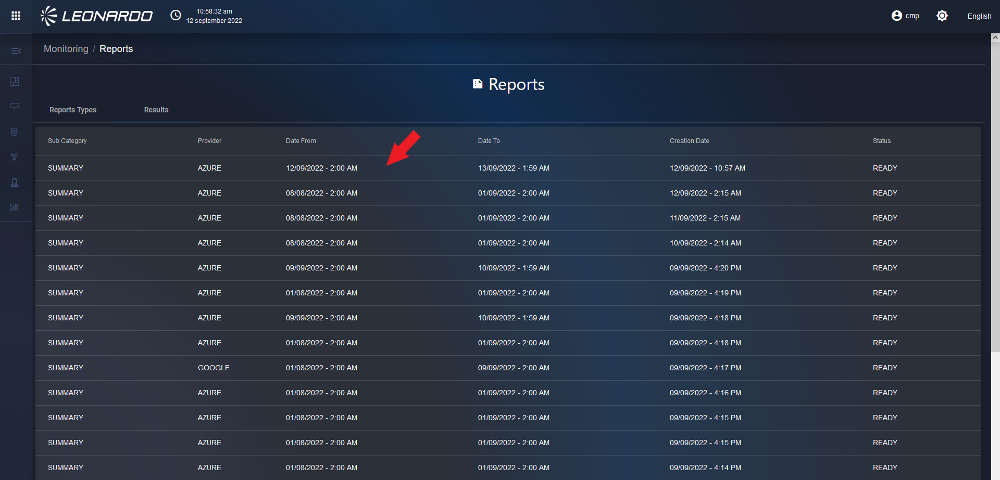

La SCMP raccoglie le metriche su tutti i cloud provider e le aggrega per
macrocategorie.

Questa aggregazione (modificabile editorialmente) permette il confronto
tra metriche su provider diversi.

Accedendo alla dashboard, possiamo vedere come questo meccanismo di
aggregazione, permetta di avere una panoramica sull’utilizzo delle
risorse suddivise per provider e organizzate per tipo di risorsa
associata.

Visualizzando il dettaglio delle singole metriche invece, questo
meccanismo, ci permette di confrontare metriche cross provider.

Utilizzando i menu in alto sopra il breadcrumb, è possibile accedere al
dettaglio delle metriche per tipologia di asset. Qui si potranno
confrontare asset su provider diversi, visualizzare le metriche fino a
due anni, modificare la granularità dei dati ed esportare i risultati in
vari formati.

Si può accedere al modulo di monitoring tramite l’apposito menu. Come
mostrato in figura:

Figura 238 - Accesso al Modulo di Monitoring

La dashbord si presenta con un overview di tutti i provider associati,
mostrando metriche per vm, dischi, network e cluster k8s. Come mostrato
in figura:

<figure>

<figcaption aria-hidden="true">Immagine che contiene testo, monitor,
interni, schermo Descrizione generata automaticamente</figcaption>
</figure>

Figura 239 - Dashboard di Monitoring

L’utente si ritroverà all’interno della pagina del tab “Dashboard” di
Monitoring in cui sono presenti le seguenti sezioni: “VM”, “Storage”,
“Network”, “Clusters”, “Pods” e “Reports”. In ciascuna sezione sono
presenti dei grafici di andamento delle metriche in funzione del tempo
(time-series singola) con percentuale di utilizzo di una determinata
metrica rispetto ad un tipo di servizio **(**Figura *240* - Grafico
delle metriche**)**.

### Metriche delle risorse “VM” “Storage” “Network”

Cliccare sul tab “Virtual Machines” per accedere all’interno della
dashboard delle metriche delle “VM” **(**Figura *240***)**.

<figure>

<figcaption aria-hidden="true">A screenshot of a computer Description
automatically generated</figcaption>
</figure>

Figura 240 - Grafico delle metriche

Per ottenere il grafico delle metriche (Figura 241) cliccare sul menu a
tendina “Provider”. All’interno del menu, è possibile cliccare su uno o
più checkbox per selezionare più provider, è anche possibile
selezionarli tutti cliccando sul checkbox “Select all”.

Successivamente, cliccare sul menu a tendina “Subsystem”. All’interno
del menu, è possibile cliccare su uno o più checkbox per selezionare più
sottosistemi, è anche possibile selezionarli tutti cliccando sul
checkbox “Select all”.

Successivamente, cliccare sul menu a tendina “Metric Name”. All’interno
del menu, è possibile cliccare solo su un tipo di metrica.

Il pulsante che raffigura un calendario all’interno del menu a tendina
“Date range” permette la selezione del range delle date.

Sopra il menu a tendina di “Date range”, è presente il menu a tendina
“Granularity” in cui sono disponibili le seguenti granularità:

- 1 Minute
- 5 Minutes
- 15 Minutes
- 30 Minutes
- 1 Hour
- 6 Hours
- 1 Day
- 1 Week

In base al range di date selezionato, si otterrà una determinata
granularità:

- La granularità a 1 minuto non sarà disponibile se il range di date \>
  di 24 ore;
- La granularità a 5 minuti non sarà disponibile se il range di date \>
  di 7 giorni;
- La granularità a 30 minuti non sarà disponibile se il range di date \>
  di 30 giorni;
- La granularità a 1 ora non sarà disponibile se il range di date \> di
  6 mesi.

Le metriche possono essere ricercate in base ai TAG associate alle
risorse (Rif. **Errore. L’origine riferimento non è stata trovata.**).

Cliccare sul campo “Search tags…” e cliccare sul menu a tendina su un
TAG, oppure compilarne uno manualmente. Si possono inserire uno o più
TAG.

È possibile selezionare dal menu a tendina di “Granularity” altre
granularità, ma come spiegato prima, tutto dipenderà dal range di date
selezionato. Inoltre, è possibile recuperare un grafico delle metriche
fino a due anni.

<figure>

<figcaption aria-hidden="true">A screen shot of a computer Description
automatically generated with low confidence</figcaption>
</figure>

Figura 241 - Ricerca delle metriche

### Ricerca per tag nel modulo di Monitoring

<figure>

<figcaption aria-hidden="true">A screen shot of a computer Description
automatically generated with low confidence</figcaption>
</figure>

Figura 242 - Ricerca delle metriche per TAG

Le metriche possono essere ricercate in base ai TAG associate alle
risorse (Rif. **Errore. L’origine riferimento non è stata trovata.**).

Cliccare sul campo “Search tags…” e cliccare nel menu a tendina su un
TAG, oppure compilarne uno manualmente **(**Figura 242**)**. Si possono
inserire uno o più TAG.

È possibile filtrare, inoltre, per provider. Selezionare il menu a
tendina “Subsystem”, all’interno del menu, è possibile cliccare su uno o
più checkbox per selezionare più sottosistemi, è anche possibile
selezionarli tutti cliccando sul checkbox “Select all”.

Fatto ciò, cliccare sul menu a tendina “Resource”. All’interno del menu,
è possibile cliccare su uno o più checkbox per selezionare più risorse,
è anche possibile selezionarli tutti cliccando sul checkbox “Select all
(max. 10)” limitandosi però ad una selezione di massimo dieci risorse.

Il menu “Metric Name” è a singola selezione. Questo per evitare di
confrontare metriche diverse.

Per ottenere le metriche degli “Storage”, “Network”, “Clusters” o “Pods”
cliccare nei rispettivi tab posizionati nella barra superiore e ripetere
gli step descritti precedentemente.

### Shortcut dal Clusters alle metriche delle VM che lo compongono

Accedendo al sottomenu Clusters è possibile spostarsi dal grafico delle
metriche del cluster direttamente alle metriche delle risorse che
compongono il cluster mediante la seguente procedura:

- Accedere al sottomodulo Clusters;
- Selezionare sul filtro:
- Provider: OpenShift;
- Sottosistema: uno tra quelli disponibili;
- Risorsa: una tra quelle disponibili;
- Metriche: una tra quelle disponibili che restituisca grafici con dati;
- Passando il mouse sul grafico restituito verrà mostrata una finestra
  che riporta la risorsa del cluster di cui sono evidenziate le metriche
  misurate;
- Su tale grafico cliccare sul puntino associato alla finestra.

<figure>

<figcaption aria-hidden="true">A screenshot of a computer Description
automatically generated</figcaption>
</figure>

Figura 243 - Grafico con shortcut a sottomodulo Virtual Machines

Verranno aperte le metriche delle risorse all’interno del sottomenu
Virtual Machines (Figura *244*)

****

Figura 244 - Grafico delle metriche su Virtual Machines

### Reportistica Monitoring

È possibile esportare i risultati in formato csv, excel o pdf.

Per accedere alla funzionalità cliccare su Reports come da Figura 245.

<figure>

<figcaption aria-hidden="true">A screen shot of a computer Description
automatically generated with medium confidence</figcaption>
</figure>

Figura 245 - Accesso al report di Monitoring

L’utente si ritrova all’interno del tab “Report Types” in cui è
necessario cliccare sul pulsante “RUN NOW” in corrispondenza di
“Monitoring Summary” per avviare la modale in cui è possibile inserire i
filtri per la creazione del report **(**Figura 246**)**.

Figura 246 - Esecuzione del report

Una volta che sarà aperta la modale dei filtri, è possibile compilare
alcuni o tutti i parametri. Una volta compilati i parametri desiderati,
in basso a destra della modale, cliccare sul pulsante “Submit” (Figura
247**)**.

<figure>

<figcaption aria-hidden="true">A screenshot of a computer Description
automatically generated</figcaption>
</figure>

Figura 247 - Applicazione dei filtri report

Fatto ciò, l’utente si ritrova all’interno del tab “Results” in cui è
presente lo storico di tutti i report (Figura 248).

<figure>

<figcaption aria-hidden="true">A screenshot of a computer Description
automatically generated</figcaption>
</figure>

Figura 248 - Gestione dello storico dei report

Per visualizzare i dettagli del report generato, cliccare sul report
come indicato dalla freccia. A questo punto, l’utente si ritrova
all’interno del sommario del report (Figura 249).

All’interno del singolo report sono riportati i filtri usati dall’utente
per generare il report stesso. Sotto i filtri, è presente la tabella
riassuntiva delle risorse appartenenti al provider. A destra sono
presenti due pulsanti: “PRINT” ed “EXPORT”. Cliccando sul pulsante
“PRINT”, appare una modale di anteprima della stampa. Per stampare il
report, cliccare sul pulsante in basso a destra “Stampa”, a questo punto
si avvierà la stampa del suddetto.

Cliccando sul pulsante “EXPORT”, è possibile esportare il report in
formato “.csv”, “. json” o “.pdf”.

Per tornare al tab “Results”, in basso a destra, cliccare sul pulsante
“CLOSE” oppure in alto a sinistra cliccare sulla freccia che punta verso
la sinistra, accanto al titolo del report.

<figure>

<figcaption aria-hidden="true">A screenshot of a computer Description
automatically generated</figcaption>
</figure>

Figura 249 - Sommario del report

Nel tab “Results” in cui è presente lo storico di tutti i report, in
basso a destra della pagina, è possibile selezionare il numero di
elementi da visualizzare per pagina.

Le frecce racchiuse all’interno del rettangolo consentono all’utente di
visualizzare gli elementi delle pagine successive e precedenti. Invece,
le frecce al di fuori del rettangolo consentono di spostarsi nell’ultima
e nella prima pagina (Figura 250).

<figure>

<figcaption aria-hidden="true">Immagine che contiene testo, elettronico,
screenshot, computer Descrizione generata automaticamente</figcaption>
</figure>

Figura 250 - Gestione pagine report

È possibile accedere al tab “Result” cliccando nel menù presente sulla
pagina di scelta della tipologia di report (Figura 251)

Figura 251 - Accesso ai report precendenti