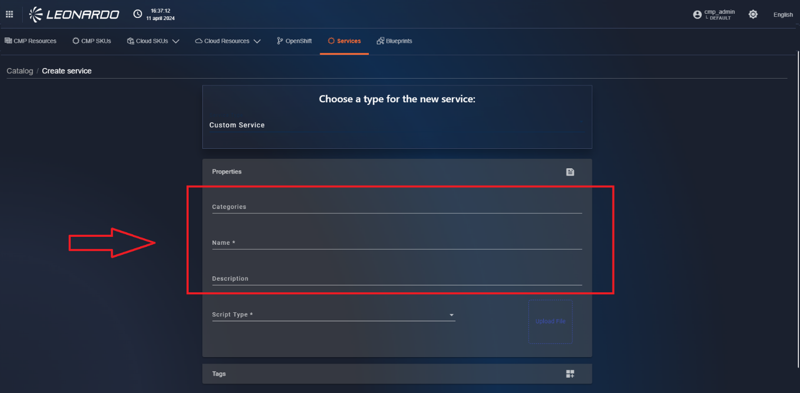

La sezione Catalog ha tre importanti funzionalità:

- Mostrare l’elenco degli asset installabili recuperati dai provider con
  i relativi prezzi e regioni associabili.
- Dare la possibilità all’amministratore del tenant di definire gli item
  utilizzabili successivamente per il provisioning.
- Dare la possibilità all’amministratore del tenant di definire gli item
  utilizzabili successivamente all’ interno delle simulazioni del modulo
  What If.

I prezzi recuperati, oltre a essere visibili all’interno del dettaglio
dell’asset, vengono utilizzati per gli scenari What If e il calcolo dei
costi.

Per accedere alla funzionalità di Catalog, in alto a sinistra cliccare
sul pulsante bento.

Dopodiché, cliccare su “Catalog” (Figura 125).

<figure>

<figcaption aria-hidden="true">Immagine che contiene schermata, testo,
software, Software multimediale Descrizione generata
automaticamente</figcaption>
</figure>

Figura 125 - Accesso a Catalog

A questo punto, l’utente si ritrova all’interno della pagina del tab
“Resources” (Figura 126).

Possiamo suddividere la funzionalità in 3 sezioni per specificarne il
comportamento:

\- Elementi di catalogo CMP ( riquadro giallo nell’ immagine)

\- Elementi di catalogo dei Providers (riquadro verde nell’ immagine)

\- Servizi e blueprint di catalogo CMP (riquadro rosso nell’ immagine)

Di seguito analizzeremo ogni gruppo di funzionalità separatamente.

Figura 126 - Catalogo della SCMP

### Gestione Elementi di catalogo SCMP

All’interno della pagina sono presenti una serie di filtri che una volta
selezionati e cliccando sul pulsante che raffigura una lente
d’ingrandimento verranno utilizzati per filtrare la lista dei risultati
(Figura 127)

<figure>

<figcaption aria-hidden="true">Immagine che contiene schermata, testo,
software, Software multimediale Descrizione generata
automaticamente</figcaption>
</figure>

Figura 127 - Catalogo SCMP filtrato

Accanto al pulsante che raffigura una lente d’ingrandimento, è presente
il pulsante che raffigura una “X” per effettuare il reset dei filtri e
della tabella delle risorse.

Sotto il filtro di ricerca, è presente il filtro di ricerca per tag.
(Rif.5.10.2 )

Cliccare su di esso e selezionare un tag, a questo punto la tabella
restituisce le risorse associate con il tag selezionato dall’utente.

#### Relazioni tra risorse

All’ interno della SCMP è possibile configurare una risorsa di tipo
“Relazione”, questa relazione consente di mappare le macchine dei vari
provider per modificarne i costi e permetterne l’utilizzo nelle altre
funzionalità.

Per accedere alla pagina delle relazioni cliccare il tab “CMP Resources”
in alto nella funzionalità di Catalogo.(Figura 128)

Figura 128 - Accesso a “Relazioni”

In alto è presente una sezione filtri che permette la ricerca per:

- “Search” : permette di inserire un testo libero per la ricerca
- “Search By tags” : permette di cercare tramite i tag associati alle
  risorse
- “Search by Service name”: permette la ricerca tramite nome del
  servizio.

##### Export delle risorse

Per esportare l’elenco delle risorse del Catalogo presenti all’interno
della lista, all’interno della pagina in alto a destra cliccare
sull’hamburger menu, e poi cliccare su “Export” (Figura 129).

L’operatore avrà la possibilità di esportare la lista dei risultati in
formato .csv e/o .json.

<figure>

<figcaption aria-hidden="true">A screenshot of a computer Description
automatically generated</figcaption>
</figure>

Figura 129 – Scaricare la lista di risultati

##### Funzionalità Aggiornamento Forzato del Catalogo

Attraverso la funzionalità di Force Sync, è possibile richiedere un
aggiornamento del catalogo cliccando sull’hamburger menù e
successivamente cliccando su “Force Sync”( Figura 130)

<figure>

<figcaption aria-hidden="true">A screenshot of a computer Description
automatically generated with medium confidence</figcaption>
</figure>

Figura 130 – Funzionalità Force Sync

##### Creazione relazione di Catalogo

Per creare una risorsa sul Catalogo, sempre all’interno della pagina in
alto a destra cliccare sull’hamburger menu, e poi cliccare su “Add
Catalog Resource” (Figura 131).

<figure>

<figcaption aria-hidden="true">A screenshot of a computer Description
automatically generated</figcaption>
</figure>

Figura 131 - Opzione per aggiungere una risorsa

A questo punto, l’utente si ritrova all’interno della pagina in cui è
possibile selezionare il tipo di risorsa da creare (Figura 132).

<figure>

<figcaption aria-hidden="true">A screenshot of a computer Description
automatically generated</figcaption>
</figure>

Figura 132 - Selezione del tipo di risorsa da creare

Dal menu a tendina, selezionare il tipo di risorsa da creare. Dopodiché,
cliccare sul pulsante “Next”. Ci si ritrova all’interno della pagina di
compilazione della risorsa (Figura 133).

Figura 133 – Esempio di form per la creazione di una relazione

I singoli parametri da inserire nella sezione “Properties” venogno
specificati nella tabella:

Vengono indicati con \* i parametri obbligatori

| **Nome**        | **Tipo** | **Descrizione**                                                                                 | **esempio**      |
|-----------------|----------|-------------------------------------------------------------------------------------------------|------------------|
| cateogry        | string   | Inserire la categoria di appartenenza della risorsa                                             | CAT0004BT        |
| Price list code | string   | Inserire il codice identificativo del listino prezzi dal quale vengono ricavate le associazioni | PRC005DE         |
| confidential    | boolen   | Se abilitato indica che la risorsa è di tipo confidenziale                                      | false            |
| description     | string   | Inserire una descrizione libera della risorsa                                                   | Low end machine  |
| Name\*          | string   | Inserire il nome della risorsa                                                                  | 8Core16GB- small |
| RAM(GIB)\*      | integer  | Inserisci qui il la quantità in GiB utilizzate dalle macchine inserite nella relazione          | 16               |
| VCPU\*          | integer  | Inserisci qui il numero di vCPU utilizzate dalle macchine inserite nella relazione              | 8                |

Tabella 26 – Campi specifici relazione VM

All’interno della pagina di creazione della risorsa (Figura 134),
compilare tutti i campi della sezione “Properties”. Dopo aver fatto ciò,
selezionare uno o più tag per il campo “Add SCMP tag…” e compilare delle
note all’interno della sezione “Tags & Note”

. 

Figura 134 - Sezione tag e note

All’interno della sezione “Relations”, aprire la sezione a sinistra
(Figura 135), successivamente è possibile utilizzare i filtri “search”
con testo libero o selezionare un “System Type” tra quelli disponibili
per filtrare la tabella delle risorse

Una volta individuata la risorsa da associare portare , utilizzando il
drag and drop, la risorsa dalla parte destra della pagina alla parte
sinistra.

È possibile aggiungere una sola risorsa per tipologia di provider, se
l’utente prova a inserire un’altra risorsa dello stesso provider
apparirà un pop up che invita l’utente ad aggiungere una sola risorsa
per provider.

Figura 135 - Selezione del provider per associare le risorse

Possiamo effettuare una associazione “A uno a Uno” inserendo in questa
sezione una sola macchina, in questo modo il sistema ci permette di
selezionare manualmente, nella sezione “Cost” in basso (Figura 136), un
prezzo personalizzato da associare alla risorsa. Per farlo bisogna
selezionare l’ intervallo di fatturazione (orario, giornaliero,
settimanale, mensile) e inserire a destra il costo (che valuta?)
relativo al periodo selezionato.

<figure>

<figcaption aria-hidden="true">Immagine che contiene testo, schermata,
software, Software multimediale Descrizione generata
automaticamente</figcaption>
</figure>

Figura 136 - Sezione costi delle relazioni

Selezionando più di una macchina per provider, la sezione costi viene
nascosta automaticamente, i costi applicati saranno definiti dalle
percentuali configurate nei sottosistemi. (Figura 137).

Figura 137 - Risorse associate alla risorsa SCMP

Una volta inserite le risorse in relazione, nella sezione ‘Relations
Chart’ si creerà automaticamente un diagramma illustrativo (Figura 138).

Figura 138 – Creazione automatica del Relation Chart

Infine, in basso a destra, cliccare sul pulsante “Save” per salvare le
modifiche. Apparirà un banner in basso che avvisa l’utente dell’avvenuta
creazione della risorsa, e viene reindirizzato nella pagina contenente
la lista di risorse.

##### Utilizzo della tabella di Catalogo

###### Visualizzazione riepilogo Risorsa

Per visualizzare i dati di una risorsa di SCMP, nella pagina “Resources”
di Catalog, nella lista delle risorse, in corrispondenza di una risorsa
cliccare sul record di interesse, apparirà una finestra che riporta
piccole informazioni della risorsa individuata: Sistema, Nome, Taglia ,
Data aggiornamento , RAM e CPU come presente nell’immagine seguente
(Figura 139).

<figure>

<figcaption aria-hidden="true">A screenshot of a computer Description
automatically generated</figcaption>
</figure>

Figura 139 – Dettaglio rapido delle risorse di catalogo

###### Visualizzazione delle relazioni di Catalogo

Per visualizzare i dati di una risorsa di SCMP, nella pagina “Resources”
di Catalog, nella lista delle risorse, in corrispondenza di una risorsa
cliccare sul kebab menu e poi cliccare su “Show” (Figura 140).

<figure>

<figcaption aria-hidden="true">A screenshot of a computer Description
automatically generated</figcaption>
</figure>

Figura 140 - Accesso alla risorsa in modalità view

Dopo aver fatto ciò, l’utente si ritrova all’interno della pagina della
risorsa in modalità view, nel quale potrà visualizzare i dati ma non
potrà modificarli (Figura 141).

<figure>

<figcaption aria-hidden="true">A screenshot of a computer Description
automatically generated with medium confidence</figcaption>
</figure>

Figura 141 - Dettaglio completo delle risorse di catalogo

Il dettaglio di una risorsa è suddiviso in varie sezioni:

\- Details.

\- Properties (Figura 142).

\- Tags & Notes (Figura 143).

\- Relations: (Figura 144).

\- Cost, se presente

\- Relations Chart (Figura 145).

<figure>

<figcaption aria-hidden="true">A screenshot of a computer Description
automatically generated</figcaption>
</figure>

Figura 142 - Sezione proprietà degli elementi del catalogo

<figure>

<figcaption aria-hidden="true">A screenshot of a computer Description
automatically generated with medium confidence</figcaption>
</figure>

Figura 143 - Sezione Tags & Note degli elementi del catalogo

<figure>

<figcaption aria-hidden="true">A screenshot of a computer Description
automatically generated</figcaption>
</figure>

Figura 144 - Sezione delle relazioni del catalogo SCMP

<figure>

<figcaption aria-hidden="true">A screenshot of a computer Description
automatically generated</figcaption>
</figure>

Figura 145 - Sezione Relations Chart delle risorse

In basso a destra, cliccare sul pulsante “Close”. L’utente verrà
reindirizzato nella pagina “Resources” di Catalog.

###### Modifica delle relazioni di Catalogo

Per modificare una risorsa di SCMP, nella pagina “Resources” di Catalog,
nella lista delle risorse, in corrispondenza di una risorsa cliccare sul
kebab menu e poi cliccare su “Edit” (Figura 146).

<figure>

<figcaption aria-hidden="true">A screenshot of a computer Description
automatically generated</figcaption>
</figure>

Figura 146 - Accesso alla risorsa in modalità edit

Dopo aver fatto ciò, l’utente si ritrova all’interno della pagina della
risorsa in modalità edit, a differenza della modalità ‘Show’ in quella
‘Edit’ è possibile modificare la sezione Properties e la sezione Cost
(Figura 147).

In basso a destra, cliccare sul pulsante “Save”. A questo punto, in
basso apparirà un banner che avvisa l’utente dell’avvenuto aggiornamento
della risorsa.

Inoltre, l’utente verrà reindirizzato nella pagina “Resources” di
Catalog.

Figura 147 - Modifica della relazione

###### Eliminazione delle relazioni di Catalogo

Per eliminare una risorsa di SCMP, nella pagina “Resources” di Catalog,
nella lista delle risorse, in corrispondenza di una risorsa cliccare sul
kebab menu e poi cliccare su “Delete” (Figura 148). Fatto ciò, appare
una modale in cui è necessario cliccare sul pulsante “Remove” per
confermare l’eliminazione della risorsa (Figura 149).

<figure>

<figcaption aria-hidden="true">A screenshot of a computer Description
automatically generated</figcaption>
</figure>

Figura 148 - Eliminazione di una risorsa

<figure>

<figcaption aria-hidden="true">A screenshot of a computer Description
automatically generated</figcaption>
</figure>

Figura 149 - Conferma eliminazione della risorsa

#### Relazioni tra SKU

All’ interno della SCMP è possibile configurare una risorsa di tipo “SKU
SCMP”, questa relazione consente di mappare gli sku ricevuti dai
provider per poterne definire i costi e l’unità di misura visualizzata
nel sistema.

Per accedere alla pagina degli SKU cliccare il tab “CMP SKU” in alto
nella funzionalità di Catalogo.(Figura 150)

<figure>

<figcaption aria-hidden="true">Immagine che contiene testo, schermata,
software, Software multimediale Descrizione generata
automaticamente</figcaption>
</figure>

Figura 150 - Accesso a “CMP SKU”

In alto è presente una sezione filtri che permette la ricerca per:

- “Search” : permette di inserire un testo libero per la ricerca
- “Search By tags” : permette di cercare tramite i tag associati alle
  risorse
- “Search by Service name”: permette la ricerca tramite nome del
  servizio.

##### Export delle risorse

Per esportare l’elenco delle risorse del Catalogo presenti all’interno
della lista, sempre all’interno della pagina del tab “SCMP” in alto a
destra cliccare sull’hamburger menu, e poi cliccare su “Export” (Figura
151).

L’operatore avrà la possibilità di esportare la lista dei risultati in
formato .csv e/o .json.

<figure>

<figcaption aria-hidden="true">A screenshot of a computer Description
automatically generated</figcaption>
</figure>

Figura 151 – Scaricare la lista di risultati

##### Creazione relazione di Catalogo SKU

Per creare una risorsa sul Catalogo, sempre all’interno della pagina del
tab “SCMP”, in alto a destra cliccare sull’hamburger menu, e poi
cliccare su “Add Catalog Resource” (Figura 152).

Figura 152 - Opzione per aggiungere una risorsa “SKU”

A questo punto, l’utente si ritrova all’interno della pagina di
creazione di una risorsa ”SKU”,cliccare sugli accordion presenti in
pagina per visualizzarne i dettagli (Figura 153).

Figura 153 – Pagina di creazione “SKU”

Nella sezione “Properties” (Figura 154) compilare tutti i campi definiti
nella tabella:

Vengono indicati con \* i parametri obbligatori

| **Nome**                      | **Tipo** | **Descrizione**                                                                                                                                                                                                                                                | **esempio**                               |
|-------------------------------|----------|----------------------------------------------------------------------------------------------------------------------------------------------------------------------------------------------------------------------------------------------------------------|-------------------------------------------|
| Price list code               | string   | Inserire il codice identificativo del listino prezzi dal quale vengono ricavate le associazioni                                                                                                                                                                | PRI002FG                                  |
| description                   | string   | Inserire una descrizione libera dello sku                                                                                                                                                                                                                      | This sku is the basic vm on this provider |
| name \*                       | string   | Inserire il nome dello SKU                                                                                                                                                                                                                                     | Simple vm sku                             |
| Service name                  | string   | Inserire il nome del servizio correlato allo SKU                                                                                                                                                                                                               | Informations service                      |
| unit                          | string   | Inserire un testo che verrà utilizzato come “unità di misura” visualizzata su tutte le funzionalità                                                                                                                                                            | MB/hour                                   |
| Unit conversion Expression \* | string   | Inserire la formula di conversione tra il valore ricevuto dal provider e il valore che verrà utilizzato nella cmp (conversione tra unità di misura del provider e unità di misura indicata nella relazione SKU) “\$var” indica il valore ricevuto dal provider | \$var \* 24 / 100                         |

Tabella 27 – Campi “Properties” specifici SKU

Figura 154 - Compilazione dei campi, selezione Properties

Dopo aver inserito la formula di conversione è necessario cliccare sul
pulsante “Test expression” per verificarne la correttezza.

Se è stata inserita correttamente il pulsante diventerà di colore
“Verde” con scritto “TEST OK” , (Figura 155) in caso contrario diventerà
di colore “Rosso” “KO”, in questo caso la possibilità di salvare la
relazione viene inibita.

<figure>

<figcaption aria-hidden="true">Immagine che contiene testo, schermata,
software, Software multimediale Descrizione generata
automaticamente</figcaption>
</figure>

Figura 155 - conferma della formula di conversione

Successivamente, selezionare uno o più tag per il campo “Add SCMP tag…”
e compilare delle note all’interno della sezione “Tags & Note”.

Nella sezione “Relation” è possibile selezionare uno o più SKU
provienienti dai vari cataloghi dei provider, per relazionarli tra loro
e unificarne i costi, per farlo cliccare nella sezione “Composition”
sulla sinistra, verrà aperta una sezione scura dove , tramite la tecnica
del drag and drop (Figura 156) possiamo spostare gli SKU disponibili
nella sezione destra .

Nella sezione destra è possibile utilizzare i filtri per visualizzare
solo i risultati pertinenti, i filtri disponibili sono , il provider d’
origine , il nome del servizio e un campo di testo libero (in giallo
nell’ immagine)

<figure>

<figcaption aria-hidden="true">Immagine che contiene testo, schermata,
software, Software multimediale Descrizione generata
automaticamente</figcaption>
</figure>

Figura 156 - Drag and drop Relazioni SKU

Una volta inserite le risorse in relazione, nella sezione ‘Relations
Chart’ si creerà automaticamente un diagramma illustrativo (Figura 157).

Figura 157 – Creazione automatica del Relation Chart

Infine, cliccare il pulsante salva per confermare la creazione della
relazione SKU, al termine si torna nella pagina contenente la lista di
relazioni SKU dove potremo trovare all’ interno della lista la nuova
relazione.

##### Utilizzo della tabella di Catalogo

###### Visualizzazione riepilogo Risorsa

Per visualizzare i dati di una risorsa SKU, nella lista delle risorse,
in corrispondenza di una risorsa cliccare sul record di interesse,
apparirà una checkbox che riporta piccole informazioni della risorsa
individuata: Sistema, Nome, Taglia , Data aggiornamento , nome e
servizio come presente nell’immagine seguente (Figura 158).

Figura 158 – Dettaglio rapido delle risorse SKU

###### Visualizzazione delle relazioni di Catalogo

Per visualizzare i dati di una risorsa SKU , nella lista delle risorse,
in corrispondenza di una risorsa cliccare sul kebab menu e poi cliccare
su “Show” (Figura 159).

Figura 159 - Accesso alla risorsa in modalità view

Dopo aver fatto ciò, l’utente si ritrova all’interno della pagina della
risorsa in modalità view, nel quale potrà visualizzare i dati ma non
potrà modificarli (Figura 160).

Figura 160 - Dettaglio completo delle risorse di catalogo

Il dettaglio di una risorsa è suddiviso in varie sezioni:

\- Details.

\- Properties (Figura 161).

\- Tags & Notes : ove nel campo “Provider Tags…” non è possibile
selezionare un tag, in quanto si ottiene automaticamente dal
sottosistema a cui appartiene; il campo “Add SCMP Tag…” permette di
selezionare dei tag da un elenco o inserirne uno manualmente; nel campo
Notes è possibile inserire una nota testuale (Figura 162).

\- Relations: ove presenti gli sku di provider in relazione (Figura
163).

\- Cost.

\- Relations Chart (Figura 164).

Figura 161 - Sezione proprietà degli elementi SKU di catalogo

Figura 162 - Sezione Tags & Note degli elementi SKU di catalogo

Figura 163 - Sezione delle relazioni degli SKU di catalogo

<figure>

<figcaption aria-hidden="true">A screenshot of a computer Description
automatically generated</figcaption>
</figure>

Figura 164 - Sezione Relations Chart delle risorse

In basso a destra, cliccare sul pulsante “Close”. L’utente verrà
reindirizzato nella pagina contenente la lista delle risorse

###### Modifica delle relazioni di Catalogo

Per modificare una risorsa di SCMP, nella pagina “Resources” di Catalog,
nella lista delle risorse, in corrispondenza di una risorsa cliccare sul
kebab menu e poi cliccare su “Edit” (Figura 165).

<figure>

<figcaption aria-hidden="true">A screenshot of a computer Description
automatically generated</figcaption>
</figure>

Figura 165 - Accesso alla risorsa in modalità edit

Dopo aver fatto ciò, l’utente si ritrova all’interno della pagina della
risorsa in modalità edit, a differenza della modalità ‘Show’ in quella
‘Edit’ è possibile modificare i parametri delle risorse

###### Eliminazione delle relazioni SKU di Catalogo

Per eliminare una risorsa SKU di catalogo, nella lista delle risorse, in
corrispondenza di una risorsa cliccare sul kebab menu e poi cliccare su
“Delete” (Figura 148). Fatto ciò, appare una modale in cui è necessario
cliccare sul pulsante “Remove” per confermare l’eliminazione della
risorsa (Figura 149).

<figure>

<figcaption aria-hidden="true">A screenshot of a computer Description
automatically generated</figcaption>
</figure>

Figura 166 - Eliminazione di una risorsa SKU

<figure>

<figcaption aria-hidden="true">A screenshot of a computer Description
automatically generated</figcaption>
</figure>

Figura 167 - Conferma eliminazione della risorsa

### Gestione elementi di catalogo ricevuti dai Provider

All’interno del Modulo Catalog è possibile visualizzare la lista ed i
dettagli delle “size” disponibili sui vari provider configurati sulla
SCMP sia per le singole risorse(VM,STORAGE,NETWORK) che per i gruppi di
risorse “SKU”

#### Risorse

Per visualizzare la lista di risorse disponibili per un provider,
selezionare in alto il menu “Cloud resources”(in rosso nell’ immagine) e
selezionare uno dei provider disponibili (in giallo nell’ immagine), le
funzionalità disponibili nelle pagine dei diversi provider sono
identiche. (Figura 168)

Figura 168 - Risorse del catalogo dei providers

##### Export dei tagli del Provider

Per esportare l’elenco delle risorse del Catalogo visualizzate in
pagina, in alto a destra cliccare sull’hamburger menu, e poi cliccare su
“Export” (Figura 169).

L’operatore avrà la possibilità di esportare la lista dei risultati in
formato .csv e/o .json.

<figure>

<figcaption aria-hidden="true">A screenshot of a computer Description
automatically generated with medium confidence</figcaption>
</figure>

Figura 169 – Esportazione dei risultati

##### Funzionalità Aggiornamento Forzato del Catalogo

È possibile forzare il sistema affinché dopo qualche minuto, vengano
aggiornate automaticamente tutte le “size” e i relativi costi associati,
per farlo, cliccare in alto a destra sull’hamburger menu, e poi cliccare
su “Force Sync” (Figura 170).

<figure>

<figcaption aria-hidden="true">A screenshot of a computer Description
automatically generated</figcaption>
</figure>

Figura 170 - Funzionalità Force Sync

##### Filtri delle risorse

Viene data la possibilità all’ utente di filtrare le liste di risorse
visualizzate, in alto nella pagina è presente una sezione filtri (Figura
171) , i filtri disponibili sono:

- “search” : permette di cercare le risorse con un testo libero
- “search by type” : permette di cercare le risorse di una sola
  tipologia specifica
- “search by tags” permette di cercare tutte le risorse che contengono
  un tag specifico (Rif.5.10.2)

Dopo aver inserito uno o più filtri cliccare il pulsante “lente di
ingrandimento” per effettuare la ricerca.

<figure>

<figcaption aria-hidden="true">Immagine che contiene schermata, testo,
software, Software multimediale Descrizione generata
automaticamente</figcaption>
</figure>

Figura 171 - Filtri del Catalogo

##### Visualizzazione Riepilogo Risorsa

Per visualizzare l’anteprima di una risorsa in corrispondenza di una
risorsa cliccare sul record di interesse, apparirà una modale che
riporta le informazioni generali della risorsa individuata, tra cui :
Sistema, Nome, Taglia , Data aggiornamento , RAM e CPU come presente
nell’immagine seguente (Figura 172).

<figure>

<figcaption aria-hidden="true">A screenshot of a computer Description
automatically generated</figcaption>
</figure>

Figura 172 – Dettaglio rapido delle risorse di catalogo

##### Visualizzazione dei dettagli delle Risorse

Per visualizzare i dati di una risorsa, in corrispondenza di una risorsa
cliccare sul kebab menu e poi cliccare su “Show” (Figura 173). Dopo aver
fatto ciò, l’utente si ritrova all’interno della pagina della risorsa in
modalità view, nel quale potrà visualizzare i dati ma non potrà
modificarli (Figura 174).

<figure>

<figcaption aria-hidden="true">A screenshot of a computer Description
automatically generated</figcaption>
</figure>

Figura 173 - Accesso alla risorsa in modalità view

<figure>

<figcaption aria-hidden="true">A screenshot of a computer Description
automatically generated with medium confidence</figcaption>
</figure>

Figura 174 - Dettaglio Risorsa dal Modulo Catalog

Il dettaglio di una risorsa è suddiviso in varie sezioni:

\- Details

\- Properties

\- Tags & Notes

\- Cost

Nella sezione Cost è possibile selezionare in successione la Regione, la
Zona e la tipologia di Costo per ottenere una preview dei costi relativi
alla risorsa selezionata (Figura 175).

<figure>

<figcaption aria-hidden="true">A screenshot of a video Description
automatically generated with medium confidence</figcaption>
</figure>

Figura 175 - Sezione costi della risorsa

In basso a destra, cliccare sul pulsante “Close” per tornare alla lista.

#### SKU

Per visualizzare la lista degli sku disponibili per un provider,
selezionare in alto il menu “Cloud SKU”(in rosso nell’ immagine) e
selezionare uno dei provider disponibili (in giallo nell’ immagine), le
funzionalità disponibili nelle pagine dei diversi provider sono
identiche. (Figura 168)

Figura 176 - Risorse del catalogo dei providers

##### Export dei tagli del Provider

Per esportare l’elenco delle risorse del Catalogo visualizzate in
pagina, in alto a destra cliccare sull’hamburger menu, e poi cliccare su
“Export” (Figura 169).

L’operatore avrà la possibilità di esportare la lista dei risultati in
formato .csv e/o .json.

<figure>

<figcaption aria-hidden="true">A screenshot of a computer Description
automatically generated with medium confidence</figcaption>
</figure>

Figura 177 – Esportazione dei risultati

##### Funzionalità Aggiornamento Forzato del Catalogo

È possibile forzare il sistema affinché dopo qualche minuto, vengano
aggiornate automaticamente tutte le “size” e i relativi costi associati,
per farlo, cliccare in alto a destra sull’hamburger menu, e poi cliccare
su “Force Sync” (Figura 170).

<figure>

<figcaption aria-hidden="true">A screenshot of a computer Description
automatically generated</figcaption>
</figure>

Figura 178 - Funzionalità Force Sync

##### Filtri delle risorse

Viene data la possibilità all’ utente di filtrare le liste di risorse
visualizzate, in alto nella pagina è presente una sezione filtri (Figura
179) , i filtri disponibili sono:

- “search” : permette di cercare le risorse con un testo libero
- “search by Service name” : permette di cercare le risorse relative ad
  una sola tipologia di servizio
- “search by tags” permette di cercare tutte le risorse che contengono
  un tag specifico (Rif.5.10.2)

Dopo aver inserito uno o più filtri cliccare il pulsante “lente di
ingrandimento” per effettuare la ricerca.

Figura 179 - Filtri del Catalogo

##### Visualizzazione Riepilogo Risorsa

Per visualizzare l’anteprima di una risorsa in corrispondenza di una
risorsa cliccare sul record di interesse, apparirà una modale che
riporta le informazioni generali della risorsa individuata, tra cui :
Sistema, Nome, Taglia , Data aggiornamento , nome del servizio (Figura
172).

Figura 180 – Dettaglio rapido delle risorse di catalogo

##### Visualizzazione dei dettagli delle Risorse

Per visualizzare i dati di una risorsa, in corrispondenza di una risorsa
cliccare sul kebab menu e poi cliccare su “Show” (Figura 173). Dopo aver
fatto ciò, l’utente si ritrova all’interno della pagina della risorsa in
modalità view, nel quale potrà visualizzare i dati ma non potrà
modificarli (Figura 174).

<figure>

<figcaption aria-hidden="true">A screenshot of a computer Description
automatically generated</figcaption>
</figure>

Figura 181 - Accesso alla risorsa in modalità view

.

Figura 182 - Dettaglio Risorsa dal Modulo Catalog

Il dettaglio di una risorsa è suddiviso in varie sezioni:

\- Details

\- Properties

\- Tags & Notes

\- Cost

Nella sezione Cost è possibile selezionare in successione la Regione, la
Zona e la tipologia di Costo per ottenere una preview dei costi relativi
alla risorsa selezionata (Figura 175).

<figure>

<figcaption aria-hidden="true">A screenshot of a video Description
automatically generated with medium confidence</figcaption>
</figure>

Figura 183 - Sezione costi della risorsa

In basso a destra, cliccare sul pulsante “Close” per tornare alla lista.

### Gestione elementi “Servizi e Blueprint”

#### Servizi

Per accedere alla funzionalità dei “Services”, in alto a sinistra
cliccare sul pulsante bento e poi cliccare su “Catalog” (Figura 184).

<figure>

<figcaption aria-hidden="true">A screen shot of a computer Description
automatically generated with medium confidence</figcaption>
</figure>

Figura 184 - Accesso ai “Services”

Dalla pagina “SCMP”, cliccare sul tab che raffigura tre quadrati uniti
‘Services’, posizionato sopra il path del breadcrumb. Fatto ciò, ci si
ritrova all’ interno della pagina ‘Services’, viene visualizzata una
lista di componenti denominati “Card”. ()

Ogni card fa riferimento ad un tipo di servizio specifico, essendo molti
i servizi presenti il sistema ne esegue una paginazione, in basso
possiamo utilizzare il campo “Item for page” per visualizzare più
risultati oppure utilizzare le frecce per navigare tra le liste di
servizi.

<figure>

<figcaption aria-hidden="true">Immagine che contiene testo, schermata,
software, Software multimediale Descrizione generata
automaticamente</figcaption>
</figure>

Figura 185 - Pagina dei servizi

##### Filtri della pagina “Services”

Per facilitare l’utente nella ricerca di un servizio specifico è stata
inserita nella pagina una sezione filtri laterale(), all’ interno
possiamo trovare tre filtri combinabili:

- “Filter by Text”: inserendo un testo in questo campo la lista di
  servizi verrà aggiornata per mostrare i servizi che riportano nel
  titolo o nella descrizione il testo inserito.(di colore arancione
  nell’ immagine)
- “Categories” : è possibile filtrare la lista per una o più categorie
  di servizi, la categoria viene inserita manualmente in fase di
  creazione del servizo (in verde nell’ immagine)
- “Tags”: è possibile selezionare uno o più tag per visualizzare solo i
  servizi che sono stati configurati con il tag (in rosso nell’
  immagine)

Utilizzando i filtri in combinazione tra loro, sarà possibile
visualizzare i soli servizi che soddisfano tutte le condizioni
specificate. In altre parole, la query restituirà solo i servizi che
coincidono con tutti i criteri impostati.

<figure>

<figcaption aria-hidden="true">Immagine che contiene testo, schermata,
software, Software multimediale Descrizione generata
automaticamente</figcaption>
</figure>

Figura 186 - Filtri disponibili

##### Creazione Services

Dalla pagina “Services”, è possibile per l’utente poter creare un
Service, accedendo nell’apposita sezione come mostrato in figura (Figura
187).

<figure>

<figcaption aria-hidden="true">A screenshot of a computer Description
automatically generated</figcaption>
</figure>

Figura 187 - Accesso al form di creazione del Service

All’interno della pagina di creazione è necessario selezionare una
tipologia di servizio utilizzando il campo “Service Type” per
visualizzarne i parametri obbligatori (Figura 188)

<figure>

<figcaption aria-hidden="true">Immagine che contiene schermata, testo,
Software multimediale, software Descrizione generata
automaticamente</figcaption>
</figure>

Figura 188 - Selezione della tipologia di servizio

Nei prossimi paragrafi analizzeremo nel dettaglio le singole tipologie
di servizi.

###### Servizi “Standard”

La prima tipologia di servizi disponibile per la SCMP sono i servizi
“Standard”, questi servizi sono nativamente integrati nel sistema e il
loro funzionamento non può essere modificato dall’ utente.

Lista dei servizi offerti:

- CosmosDb Cassanddra SQL
- CosmosDb Core SQL
- CosmosDb Mongo
- Kafka 3.2.1 on Ubuntu 20.04 LTS
- Kafka 3.2.1 on Ubuntu 22.04 LTS
- Mongo DB 5.0 on Ubuntu 20.04 LTS
- Mongo DB 6.0 on Ubuntu 20.04 LTS
- Mongo DB 6.0 on Ubuntu 22.04 LTS
- MySQL DB 8.0 on Ubuntu 20.04 LTS
- MySQL DB 8.0 on Ubuntu 22.04 LTS
- PostgreSQL 14 on Ubuntu 20.04 LTS
- PostgreSQL 14 on Ubuntu 22.04 LTS
- Redis DB 7.0 on Ubuntu 20.04 LTS
- Redis DB 7.0 on Ubuntu 22.04 LTS

Per inserire un nuovo servizio è necessario compilare tutti i campi
della sezione properties (Figura 189)

Nello specifico:

- “Categories”: inserire un testo libero nel campo e selezionare dalla
  dropdown una categoria già configurata oppure è possibile aggiungere
  una nuova categoria cliccando il pulsante “+” nella dropdown (in
  arancione nella pagina)
- “Name”: il nome del servizio che sarà visualizzato nella card
  corrispondente
- “Description”: la descrizione del servizio che verrà mostrata nella
  card relativa
- “Upload File”: cliccando questo controllo sarà possibile selezionare
  dal proprio PC un file di tipo “immagine” che verrà visualizzato nella
  card del servizio.
- “Related Software”: in questa sezione è possibile selezionare uno o
  più software “Standard” che verranno poi utilizzati in fase di
  provisioning.

Figura 189 - Aggiunta nuova categoria

Una volta inseriti tutti i dati è possibile salvare il servizio
utilizzando il pulsante “save” in basso a destra, verrà visualizzata una
modale di conferma e l’utente viene reindirizzato nella lista dei
servizi disponibili.

###### Servizi “Custom”

Viene data la possibilità all’ utente di definire dei servizi “Custom”
tramite inserimento di un file zip con all’ interno tutti file necessari
per l’esecuzione.

In questo caso specifico il sistema SCMP viene utilizzato solo per
salvare il servizio e lanciarne l’esecuzione, non è quindi possibile
effettuare un controllo sulla correttezza del processo, che dovrà essere
gestito dall’ utente.

(VALUTARE SE NECESSARIA QUESTA SEZIONE AI boosted)

sono tutti orchestratori, ma con funzionalità e scopi differenti:

**1. Ansible:**

- **Orchestrazione di server e applicazioni:** Ansible automatizza la
  configurazione e la gestione di server e applicazioni su diverse
  piattaforme.
- **Esegue playbook YAML:** Ansible utilizza playbook YAML per definire
  le istruzioni da eseguire sui server.
- **Non richiede agent:** Ansible è agentless, non richiede
  l’installazione di software sui server da gestire.

**2. Bicep:**

- **Linguaggio DSL per Azure:** Bicep è un DSL specifico per Azure che
  facilita la definizione di infrastruttura come codice.
- **Crea modelli ARM:** Bicep traduce i file in modelli ARM (Azure
  Resource Manager) che Azure utilizza per creare le risorse.
- **Si integra con Azure DevOps:** Bicep si integra con Azure DevOps per
  la gestione del ciclo di vita.

**3. Kubernetes:**

- **Orchestrazione di container:** Kubernetes è la piattaforma leader
  per l’orchestrazione di container su larga scala.
- **Automatizza la distribuzione e la gestione:** Kubernetes automatizza
  la distribuzione, il ridimensionamento e la gestione di container in
  cluster.
- **Offre un ecosistema di strumenti:** Kubernetes offre un ricco
  ecosistema di strumenti e librerie per la gestione dei container.

**4. Terraform:**

- **Infrastructure as Code:** Terraform è un tool open source per la
  gestione dell’infrastruttura come codice.
- **Definisce l’infrastruttura in file HCL:** Terraform utilizza file di
  configurazione HCL per definire l’infrastruttura desiderata.
- **Supporta diversi provider:** Terraform supporta un’ampia gamma di
  provider cloud e on-premise.

**In sintesi:**

- **Ansible:** Ideale per automatizzare la configurazione di server e
  applicazioni.
- **Bicep:** Ottimo per definire l’infrastruttura su Azure in modo
  leggibile.
- **Kubernetes:** Potente strumento per l’orchestrazione di container su
  larga scala.
- **Terraform:** Flessibile per gestire l’infrastruttura su più cloud
  provider o on-premise

Nella configurazione dei servizi “Custom” possiamo individuare una
sezione comune composta dai parametri iniziali (Figura 190) :

- “Categories”: inserire un testo libero nel campo e selezionare dalla
  dropdown una categoria già configurata oppure è possibile aggiungere
  una nuova categoria cliccando il pulsante “+” nella dropdown
- “Name”: il nome del servizio che sarà visualizzato nella card
  corrispondente
- “Description”: la descrizione del servizio che verrà mostrata nella
  card relativa

Figura 190 Parametri generali dei “Custom Services”

Successivamente è necessario scegliere la tipologia di “orchestratore”
da utilizzare (Figura 191) e inserire il file “.zip” corrispondente
nella sezione “Upload File”, di seguito vengono indicate le specifiche
per ogni tipologia:

| **Tipologia script** | **Contenuto obbligatorio del file .zip** |
|----------------------|------------------------------------------|
| Ansible              | Instance.yaml - Vars.yaml                |
| Bicep                | Main.bicep - Main.parameters.json        |
| Kubernetes           | Solo files di tipo .YAML                 |
| Terraform            | Main.tf - Variable.tf - Provider.tf      |

Oltre ai files descritti nella tabella è possibile aggiungere nello zip
un file di tipo “.png / .jpg / .img” che verrà poi utilizzato come
immagine della Card corrispondente

<figure>

<figcaption aria-hidden="true">Immagine che contiene testo, schermata,
software, Software multimediale Descrizione generata
automaticamente</figcaption>
</figure>

Figura 191 - Selezione della tipologia di Orchestratore

Una volta inseriti tutti i dati è possibile salvare il servizio
utilizzando il pulsante “save” in basso a destra, verrà visualizzata una
modale di conferma e l’utente viene reindirizzato nella lista dei
servizi disponibili

###### Servizi “azure pipeline”

Viene data la possibilità all’ utente di definire dei servizi “Azure
Pipeline” Questa tipologia di servizio permette alla SCMP di invocare
l’esecuzione di una pipeline remota DEVOPS e successivamente potrà
esssere richiamata dalla funzionalità di “Provisioning”.

Nella configurazione dei servizi “Azure Pipeline” possiamo individuare
una sezione generale composta dai parametri (Figura 192) :

- “Categories”: inserire un testo libero nel campo e selezionare dalla
  dropdown una categoria già configurata oppure è possibile aggiungere
  una nuova categoria cliccando il pulsante “+” nella dropdown
- “Name”: il nome del servizio che sarà visualizzato nella card
  corrispondente
- “Description”: la descrizione del servizio che verrà mostrata nella
  card relativa

Figura 192 Parametri generali “Azure pipeline service”

Anche per questo servizio sarà possibile, tramite il campo “upload File”
, inserire un file di tipo “.zip” che contenga nello zip un file di tipo
“.png / .jpg / .img” che verrà poi utilizzato come immagine della Card
corrispondente.

Successivamente sarà necessario compilare i parametri specifici del
servizio(Figura 193), in particolare bisognera inserire:

- “Organizzazione” : il nome dell’ organizzazione DevOps dove risiede la
  pipeline
- “Project”: il nome del progetto DevOps dove risiede la pipeline
- “PAT”: il personal access token privato generato dal portale “Azure
  DevOps” (rif a come si fa?)

Una volta compilati questi campi è possibile cliccare il pulsante “Test”
per verificare i parametri inseriti.(Figura 193)

Se i dati inseriti non sono validi verranno visualizzati diversi
messaggi di errore che indicano quale parametro è errato (ad esempio:
“Specified Organization is not valid.”) e il pulsante diventa rosso con
scritto “KO”, quando tutti i parametri sono corretti il pulsante diventa
di colore Verde con scritto “OK”.

Figura 193 - Parametri specifici delle Pipeline

Dopo aver effettuato il test correttamente sarà possibile selezionare la
pipeline da eseguire utilizzando il campo “Select Pipeline” e cliccando
su una opzione disponibile(Figura 194)

<figure>

<figcaption aria-hidden="true">Immagine che contiene testo, software,
Software multimediale, Icona del computer Descrizione generata
automaticamente</figcaption>
</figure>

Figura 194 - Selezione della pipeline

Una volta inseriti tutti i dati è possibile salvare il servizio
utilizzando il pulsante “save” in basso a destra, verrà visualizzata una
modale di conferma e l’utente viene reindirizzato nella lista dei
servizi disponibili

###### Servizi “PaaS”

Possiamo configurare all’ interno della SCMP anche dei servizi di tipo
“PaaS”, per la configurazione di questi servizi è necessario inserire
questi parametri (Figura 195) :

- “Categories”: inserire un testo libero nel campo e selezionare dalla
  dropdown una categoria già configurata oppure è possibile aggiungere
  una nuova categoria cliccando il pulsante “+” nella dropdown
- “Name”: il nome del servizio che sarà visualizzato nella card
  corrispondente
- “Description”: la descrizione del servizio che verrà mostrata nella
  card relativa
- “Company” : il nome della società che ha rilasciato il servizio
- “Publisher”: il nome del pubblicatore del servizio

Figura 195 Parametri generali dei “PaaS Services”

Successivamente è necessario inserire un file “.zip” che contenga solo
file di tipo “.json” e un file di tipo “.png / .jpg / .img” che verrà
poi utilizzato come immagine della Card corrispondente

Una volta inseriti tutti i dati è possibile salvare il servizio
utilizzando il pulsante “save” in basso a destra, verrà visualizzata una
modale di conferma e l’utente viene reindirizzato nella lista dei
servizi disponibili

###### Servizi “AI”

Infine, è possibile configurare all’ interno della CMP, dei servizi di
tipo “AI Services”, per farlo è necessario compilare i seguenti campi
(Figura 196) :

- “Categories”: inserire un testo libero nel campo e selezionare dalla
  dropdown una categoria già configurata oppure è possibile aggiungere
  una nuova categoria cliccando il pulsante “+” nella dropdown
- “Name”: il nome del servizio che sarà visualizzato nella card
  corrispondente
- “Description”: la descrizione del servizio che verrà mostrata nella
  card relativa
- “Algorithm”: nome dell’ algoritmo utilizzato dalla AI
- “Company” : il nome della società che ha rilasciato il servizio
- “Publisher”: il nome del pubblicatore del servizio
- “Platform”: piattaforma sulla quale è stata rilasciata l’ api
- “Machine Learning Task”:
- “Swagger”: inserire il link allo swagger che contiene tutte le API del
  servizio
- “resource Link”: il link diretto alla risorsa

<figure>

<figcaption aria-hidden="true">Immagine che contiene testo, schermata,
software, Software multimediale Descrizione generata
automaticamente</figcaption>
</figure>

Figura 196 - Parametri dei “Servizi AI”

Se necessario è possibile inserire una sezione di informazioni relative
alle propietà del docker che ospita l’ AI, per sbloccare il pannello è
necessario cliccare sulla sezione “Click here to add” , a questo punto
la pagina si aggiorna per mostrare i parametri(Figura 197)

<figure>

<figcaption aria-hidden="true">Immagine che contiene testo, schermata,
software, Software multimediale Descrizione generata
automaticamente</figcaption>
</figure>

Figura 197 - Sblocco della sezione “Docker”

All’ interno di questa sezione inserire tutti i parametri visualizzati
(Figura 198) e salvare il servizio utilizzando il pulsante “save” in
basso a destra, verrà visualizzata una modale di conferma e l’utente
viene reindirizzato nella lista dei servizi disponibili

<figure>

<figcaption aria-hidden="true">Immagine che contiene testo, schermata,
software, Software multimediale Descrizione generata
automaticamente</figcaption>
</figure>

Figura 198 - Parametri della sezione docker

##### Modifica ed Eliminazione Services

Oltre alla creazione di un Service, è possibile effettuare la
visualizzazione, modifica ed eliminazione del suddetto (Figura 199).

- Per modificare le informazioni di un “Service”, cliccare sul pulsante
  “Edit” all’interno della card. Dopodiché, all’interno del form,
  l’utente può modificare i dati necessari. Dopo aver effettuato le
  operazioni di edit, in basso a destra, cliccare sul pulsante “Submit”.
  Dopo aver fatto ciò, l’utente si ritrova all’interno della pagina
  “Service”. (Figura 200)
- Per eliminare un “Service”, cliccare sul kebab menu di un suddetto e
  poi cliccare su “Delete”. Fatto ciò, appare una modale di conferma di
  eliminazione del Service. A questo punto, è necessario cliccare sul
  pulsante “Remove”. (Figura 201)

<figure>

<figcaption aria-hidden="true">A screenshot of a computer Description
automatically generated</figcaption>
</figure>

Figura 199 - Operazioni disponibili per i Services

<figure>

<figcaption aria-hidden="true">Immagine che contiene software, Software
multimediale, testo, computer Descrizione generata
automaticamente</figcaption>
</figure>

Figura 200 – Pagina di edit per un servizio

<figure>

<figcaption aria-hidden="true">Immagine che contiene testo, schermata,
software, Software multimediale Descrizione generata
automaticamente</figcaption>
</figure>

Figura 201 - Eliminazione di un servizio

#### Gestione Blueprints

Per accedere alla funzionalità dei “Services”, in alto a sinistra
cliccare sul pulsante bento e poi cliccare su “Catalog” (Figura 202).

<figure>

<figcaption aria-hidden="true">A screen shot of a computer Description
automatically generated with medium confidence</figcaption>
</figure>

Figura 202 - Accesso alle “Blueprint”

Dalla pagina “SCMP”, cliccare sul tab che raffigura tre quadrati uniti
‘Blueprint’, posizionato sopra il path del breadcrumb. Fatto ciò, ci si
ritrova all’ interno della pagina ‘Blueprint’, viene visualizzata la
lista delle blueprint configurate nel sistema. (Figura 203)

<figure>

<figcaption aria-hidden="true">Immagine che contiene testo, schermata,
software, Software multimediale Descrizione generata
automaticamente</figcaption>
</figure>

Figura 203 - Pagina delle Blueprint

##### Aggiunta nuova blueprint

Dalla pagina “Blueprint”, è possibile per l’utente poter creare una
nuova blueprint, accedendo nell’apposita sezione come mostrato in figura
(Figura 204), cliccando l’ “hamburgher menu” presente in alto a destra e
selezionando come opzione “Add Blueprint”

<figure>

<figcaption aria-hidden="true">Immagine che contiene testo, schermata,
software, Software multimediale Descrizione generata
automaticamente</figcaption>
</figure>

Figura 204 - Aggiunta nuova Blueprint

L’utente viene reindirizzato nello step 1 della creazione di una
“Blueprint” dove è possibile inserire tutte le informazioni generali
della blueprint.(Figura 205). Dopo aver inserito i dati cliccare il
pulsante “Save blueprint” per salvare la bozza della blueprint , per i
dettagli sullo status è possibile consultare il paragrafo successivo
(5.9.3.2.2)

<figure>

<figcaption aria-hidden="true">Immagine che contiene testo, software,
Software multimediale, Sistema operativo Descrizione generata
automaticamente</figcaption>
</figure>

Figura 205 - Blueprint step 1

Viene aperta una modale di conferma inserimento, (Figura 206) una volta
cliccato “yes” per continuare l’utente visualizzerà lo stato 2 della
creazione di una blueprint.

Cliccando “No” verrà annullato l’inserimento della bozza.

<figure>

<figcaption aria-hidden="true">Immagine che contiene testo, schermata,
software, Software multimediale Descrizione generata
automaticamente</figcaption>
</figure>

Figura 206 - Blueprint conferma della bozza

Nello step 2 della creazione di una Blueprint è necessario cliccare all’
interno del campo “Upload File” e utilizzando la finestra di upload
windows selezionare il file “.CSAR” che contiene la Blueprint. (Figura
207)

Dopo aver selezionato una file cliccare sul pulsante ”Upload” in basso a
destra per lanciare il processo di validazione del file, seguendo la
lista di stati presente nel paragrafo (5.9.3.2.2)

(ESTRATTO DI COME SI CREA UNA BLUEPRINT?)

Figura 207 - Inserimento file

##### Status delle Blueprint

Essendo le “Blueprint” degli oggetti complessi, che devono essere
opportunamente configurati, è stato inserito un sistema di validazione
dei files inviati per permettere l’utilizzo dei soli servizi “Blueprint”
configurati correttamente. (Figura 208)

Nello specifico esistono 4 possibili “STATUS”:

1.  READY TO USE (spunta di colore verde): indica che la blueprint è
    configurata correttamente e sarà possibile utilizzarla durante il
    “Provisioning”
2.  VERIFY (cerchio di colore giallo) indica che la SCMP sta validando
    il contenuto della Blueprint
3.  FAILED (“X” di colore rosso): indica che il file inviato non è
    valido e dovrà essere reinserito dall’utente dopo averlo corretto.
4.  DRAFT (di colore arancione) indica che la “blueprint” è stata creata
    come bozza ma non contiene all’ interno il file CSAR necessario, una
    volta inserito il file la blueprint passerà allo status VERIFY

<figure>

<figcaption aria-hidden="true">Immagine che contiene testo, schermata,
software, Software multimediale Descrizione generata
automaticamente</figcaption>
</figure>

Figura 208 - Status delle Blueprint

##### Visualizzazione, Modifica ed Eliminazione delle Blueprint

Nella tabella delle blueprint disponibili in corrispondenza di ogni
riga, sulla destra è presente un menu contestuale, una volta aperto all’
interno troviamo tre funzionalità:

la funzionalità “View”: permette di visualizzare i dettagli della
blueprint, una volta cliccato l’utente verrà reindirizzato nella pagina
di visualizzazione della blueprint (Figura 209) che contiene le sezioni
:

- Properties: in questa sezione sono disponibili le informazioni base
  della blueprint (Figura 209)
- Provisioning plan: in questa sezione è presente il grafico BPNM che ci
  fornisce una rappresentazione grafica degli “step” previsti dalla
  “Blueprint” (Figura 210) utilizzando il pulsante in alto a sinistra
  “Download” è possibile scaricare il file BPNM visualizzato.
- Topology : La topologia di una blueprint è la disposizione dei
  componenti in un cluster Kubernetes. ,in questa sezione possiamo
  visualizzare graficamente la struttura del sistema tra i diversi pod,
  servizi e componenti. (Figura 211)

Figura 209 - Sezioni della pagina Blueprint “view”

<figure>

<figcaption aria-hidden="true">Immagine che contiene schermata, schermo,
software, Software multimediale Descrizione generata
automaticamente</figcaption>
</figure>

Figura 210 - Sezione Plan di una Blueprint

<figure>

<figcaption aria-hidden="true">Immagine che contiene schermata,
Rettangolo, testo, design Descrizione generata
automaticamente</figcaption>
</figure>

Figura 211 -Sezione Topology di una Blueprint

La funzionalità “Edit”: permette di modificare tutti i parametri della
blueprint, compreso il file CSAR relativo(Figura 212),contiene le
seguenti sezioni :

- Properties: in questa sezione è possibile modificare le informazioni
  base della blueprint (Figura 212)
- Provisioning plan: in questa sezione è presente il grafico BPNM che ci
  fornisce una rappresentazione grafica degli “step” previsti dalla
  “Blueprint” (Figura 213) in questa sezione sono presenti tre pulsanti
  per modificare il plan, il primo a forma di “cartella” permette
  l’upload sulla pagina di edit di un nuovo file BPMN , il secondo
  “download” permette di scaricare l’attuale file BPNM visualizzato , il
  terzo sulla destra “Upload” effettua la sovrascrizione dell’ attuale
  file BPNM disponibile per la blueprint
- Topology : La topologia di una blueprint è la disposizione dei
  componenti in un cluster Kubernetes. ,in questa sezione possiamo
  visualizzare graficamente la struttura del sistema tra i diversi pod,
  servizi e componenti. (Figura 214)
- Update Model: in questa sezione è possibile eseguire l’upload del file
  CSAR , effettuando questa modifica la Blueprint tornerà nello stato di
  “VERIFY” per validarne il contenuto (Figura 215)

Figura 212 - Sezioni della pagina Blueprint “edit”

Figura 213 - Sezione Plan di una Blueprint

<figure>

<figcaption aria-hidden="true">Immagine che contiene schermata,
Rettangolo, testo, design Descrizione generata
automaticamente</figcaption>
</figure>

Figura 214 -Sezione Topology di una Blueprint

<figure>

<figcaption aria-hidden="true">Immagine che contiene testo, schermata,
software, Carattere Descrizione generata automaticamente</figcaption>
</figure>

Figura 215 - Sezione Model di una Blueprint

La funzionalità “Delete”: permette di eliminare definitivamentela
blueprint dal sistema, per farlo basta confermare l’eleiminazione
cliccando il tasto “Yes” visualizzato nella modale di conferma
eliminazione(Figura 216)

<figure>

<figcaption aria-hidden="true">Immagine che contiene schermata, testo,
software, Software multimediale Descrizione generata
automaticamente</figcaption>
</figure>

Figura 216 - Eliminazione di una Blueprint

### Gestione Openshift ( viene spostato su administration?)

Per configurare un modello che verrà utilizzato per calcolare i costi
dei sistemi di Openshift, selezionare dal modulo Catalog il TAB
‘Openshift’ (Figura 217)

<figure>

<figcaption aria-hidden="true">A screenshot of a computer Description
automatically generated</figcaption>
</figure>

Figura 217 - Accesso a “Openshift”

Dopo aver fatto ciò, l’utente si ritroverà all’interno della pagina del
tab “Openshift”.

Per settare il prezzo delle risorse Openshift che verrà usato sul modulo
Cost selezionare una Valuta e lo Sconto o Maggiorazione che si vuole
predisporre al modello, inserire nei riquadri ‘CPU Hourly Cost’, ‘RAM
Hourly Cost’ e ‘Storage Hourly Cost’ i vari costi.

Fatto ciò, una volta cliccato sul tasto ‘Apply’ viene visualizzata una
notifica di conferma della modifica e la data “Last Updated” in basso a
sinistra viene aggiornata . (Figura 218).

<figure>

<figcaption aria-hidden="true">A screenshot of a computer Description
automatically generated</figcaption>
</figure>

Figura 218 - Configurazione Modello “Openshift”

Premendo il tasto “DELETE”, apparirà un pop up che richiede la conferma
dell’eliminazione del componente, una volta confermato quest’ultimo
verrà eliminato dal sistema (Figura 219).

<figure>

<figcaption aria-hidden="true">A screenshot of a computer Description
automatically generated</figcaption>
</figure>

Figura 219 - Eliminazione Modello “Openshift”